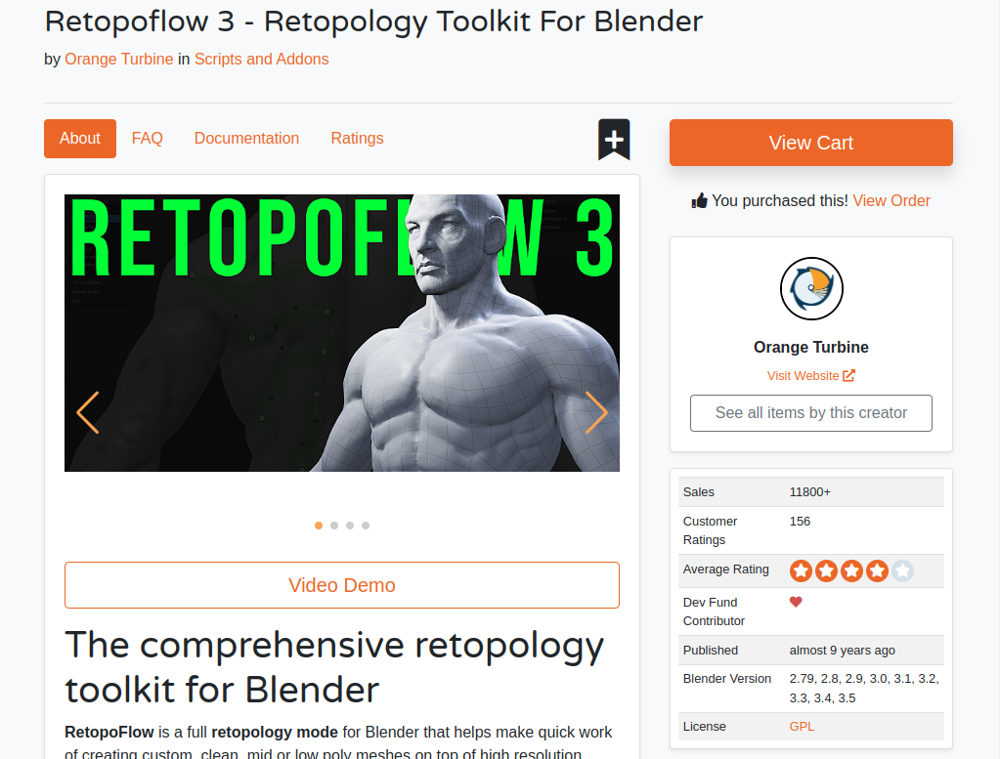

# RetopoFlow

RetopoFlow is a suite of fun, sketch-based retopology tools for Blender from [Orange Turbine](https://orangeturbine.com) that generate geometry which snap to your high poly objects as you draw on the surface.

This documentation covers the installation and usage of all tools included in the add-on.

You can read about the features and purchase a copy on [our website](https://orangeturbine.com/downloads/retopoflow) or the [Blender Market](https://blendermarket.com/products/retopoflow/).

If you’re brand new to RetopoFlow, check the [Quick Start page](https://docs.retopoflow.com/quick_start.html).
Otherwise, jump right over to the [Table of Contents](https://docs.retopoflow.com/table_of_contents.html).

## Requirements

Below is a table showing which versions of RetopoFlow and Blender are compatible.

| RetopoFlow |    Blender     |
| ---------- | -------------- |
|   4.0.0    | 4.3 or later   |
|   3.4.0    | 3.6 or later   |
|   3.3.0    | 2.93--3.5      |
|   3.2.4    | 2.8x--2.9x     |
|   2.0.3    | 2.79 or before |

All versions of RetopoFlow will work on any operating system the Blender supports.

## Downloading

Future updates to RetopoFlow are funded by Blender Market purchases, and we provide top priority support through the Blender Market.
However, we also made RetopoFlow accessible on RetopoFlow's [GitHub Page](https://github.com/CGCookie/retopoflow), especially for students, teachers, and those using RetopoFlow for educational purposes.

You may download RetopoFlow from your [account dashboard](https://blendermarket.com/account/orders) on the Blender Market once you have already purchased it or from RetopoFlow's [GitHub Releases Page](https://github.com/CGCookie/retopoflow/releases).
For the more techie crowd, you can also symlink a clone of the GitHub repo to your add-ons folder.

Important: Blender has issues with the zip files that GitHub automatically packages with the green `Code` button on the main GitHub page.
Do _not_ use the zip files created by GitHub.
Instead, use the officially packaged versions that we provide through the Blender Market or the GitHub Releases Page.

The code for RetopoFlow is open source under the [GPL 3.0](https://www.gnu.org/licenses/gpl-3.0.en.html) license.
The non-code assets in this repository are not.

## Installing

The easiest way to install RetopoFlow is to do so directly within Blender.
You can do this by going to Edit > Preferences > Add-ons > Install.
This will open a File Browser in Blender, allowing to you navigate to and select the zip file you downloaded.
Press Install from file.

_If your browser auto-extracted the downloaded zip file, then you will need to re-compress the **RetopoFlow** folder before installing, or use Save As to save the zip file without extracting the contents._

Once installed, Blender should automatically filter the list of add-ons to show only RetopoFlow.
You can then enable the add-on by clicking the checkbox next to `RetopoFlow 4`.

If you have any issues with installing, please try the following steps:

1. Download the latest version of RetopoFlow for your version of Blender (see Requirements section above).
2. Open Blender
3. Head to Edit > Preferences > Add-ons and search for RetopoFlow
4. Expand by clicking the triangle, and then press Uninstall
5. Close Blender to completely clear out the previous version
6. Open Blender and head to preferences again
7. Click Install
8. Navigate to your RetopoFlow zip file (please do not unzip)
9. Click Install Add-on
10. Enable RetopoFlow

## Getting Support

Here are ways to get help with a problem or a question that the [documentation](https://docs.retopoflow.com) isn't answering:

- Get high priority support from Orange Turbine by sending a message from your [Blender Market inbox](https://blendermarket.com/inbox) once you've purchased a copy.
- Create a new [issue](https://github.com/CGCookie/retopoflow/issues/new/choose) on RetopoFlow's [GitHub page](https://github.com/CGCookie/retopoflow).
- Reach out to us via email at [retopoflow@cgcookie.com](mailto:retopoflow@cgcookie.com).

Please provide as much information and detail as possible, such as steps to reproduce the issue, what behavior you expected to see vs what you actually saw, screenshots, and so on.
See [Debugging](https://docs.retopoflow.com/debugging.html) for details on getting as much useful information as possible.
Also, if possible, please consider sending us the `.blend` file.

## Contributing

Pull requests are welcome!
If you'd like to contribute to the project then simply fork the repo, work on your changes, and then submit a pull request.
We are quite strict on what we allow in, but all suggestions are welcome.
If you're unsure what to contribute, then look at the [open issues](https://github.com/CGCookie/retopoflow/issues) for the current to-dos.
