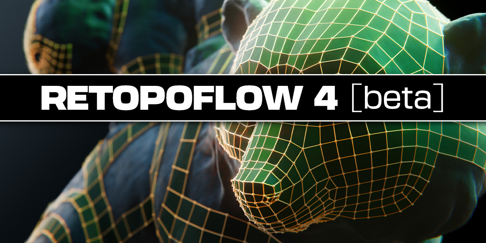

# Welcome!

Retopoflow is a suite of fun, sketch-based retopology tools for Blender, created by [Orange Turbine](https://orangeturbine.com), that generate geometry which snaps to your high poly objects as you draw on their surface.

You can read about the features and purchase a copy on [Superhive](https://blendermarket.com/products/retopoflow/) (formerly Blender Market).

If you’re brand new to Retopoflow, check the [Quick Start page](quick_start.html).

Another great place to learn the tools is our [YouTube channel](https://www.youtube.com/@orangeturbine).

## Versions 1-3

Retopoflow has been completely refactored in version 4, and this documentation has been updated to match. For information on how to use the previous versions, please refer to the in-app documentation using the version you have. 

Even though we will not be adding new featues to it, Retopoflow 3 will still be supprted for at least two years after the official launch of 4.0.

## Getting Support

You can get help with an issue or give feedback by reaching out to us in one of the following ways:

- Get high priority support from Orange Turbine by sending a message from your [Blender Market inbox](https://blendermarket.com/inbox) once you've purchased a copy.
- Create a new [issue](https://github.com/CGCookie/retopoflow/issues/new/choose) on Retopoflow's [GitHub page](https://github.com/CGCookie/retopoflow).
- Reach out to us via email at [retopoflow@cgcookie.com](mailto:retopoflow@cgcookie.com).

Please provide as much information and detail as possible, such as steps to reproduce the issue, what behavior you expected to see vs what you actually saw, screenshots, and so on. 

See the [Debugging](debugging.html) page for details on getting as much useful information as possible. Also, if possible, please consider sending us the `.blend` file.
