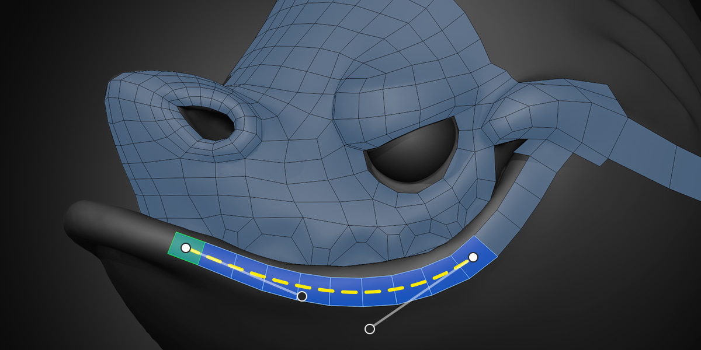

#  PolyStrips

The PolyStrips tool provides quick and easy ways to map out key face loops for complex models, as well as adjust existing strips of faces.

## Inserting

To create a strip of quads with PolyStrips, hold down `Ctrl` and `Left Mouse Drag` on the surface of a source object. 

The size of the quads corresponds to the size of the brush that you see when you hold down `Ctrl`. To adjust the size, use the hotkey `F`.

Right after you've drawn a strip, you'll be able to adjust some of its properties. 
- `Ctrl Scroll` changes the segment count
- `Shift Scroll` changes the width

These options are also available in Blender's Adjust Last Operation panel, along with a **Split Angle** property that adjusts how sharp the curve needs to be in order to be considered a corner. 

## Control Points

Any selected strip of quads will show control points and curve handles while you're using PolyStrips. Simply `Left Click Drag` on the control points or handles to adjust the strip like a Bezier curve. 

PolyStrips handles work great with Blender's proportional editing. If you enable that (hotkey `O`), you can easily adjust sections of existing loops that are already surrounded by geometry.

## Selecting

The default selection mode for PolyStrips is Face so that you can quickly select and tweak parts of strips. However, you can work in just Vertex and / or Edge select mode just as well if you prefer.  

It's helpful to remember that even though `Ctrl Left Click` to select shortest path is blocked because `Ctrl` is used to create strips, you can always do the same thing with `Ctrl Shift Left Click`. So to easily select a part of a strip, `Left Click` to select one face and then `Ctrl Shift Left Click` on another. 

## Transforming

A `Left Click Drag` on components in PolyPen will perform a tweak action similar to Blender's Tweak tool. The tweaking settings are shared across multiple tools and can be read about on the [Retopoflow Mode](general.html) docs page under Common Settings.

## Limitations

It is not currently possible to adjust segment counts or other properties on existing strips, but that is on our to-do list. 

