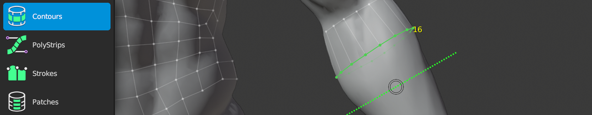

#  Contours Help

Shortcut: {{ keymaps.contours_tool }}

The Contours tool gives you a quick and easy way to retopologize cylindrical forms.
For example, it's ideal for organic forms, such as arms, legs, tentacles, tails, horns, etc.

The tool works by drawing strokes perpendicular to the form to define the contour of the shape.
Each additional stroke drawn will either extrude the current selection or cut a new loop into the edges drawn over.

You may draw strokes in any order, from any direction.

## Creating

|  |  |  |
| :--- | :--- | :--- |
| {{ keymaps.insert }}                           | : | draw contour stroke perpendicular to form. newly created contour extends selection if applicable. |
| {{ keymaps.increase_count }}                   | : | increase segment counts in selected loop |
| {{ keymaps.decrease_count }}                   | : | decrease segment counts in selected loop |
| {{ keymaps.fill }}                             | : | bridge selected edge loops |

## Selecting

|  |  |  |
| :--- | :--- | :--- |
| {{ keymaps.select_single }}, {{ keymaps.select_single_add }} | : | select edge |
| {{ keymaps.select_smart }}, {{ keymaps.select_smart_add }}   | : | smart select loop |
| {{ keymaps.select_paint }}, {{ keymaps.select_paint_add }}   | : | paint edge selection |
| {{ keymaps.select_all }}                       | : | select / deselect all |
| {{ keymaps.deselect_all }}                     | : | deselect all |

## Transforming

|  |  |  |
| :--- | :--- | :--- |
| {{ keymaps.action }}           | : | grab and slide selected geometry under mouse |
| {{ keymaps.grab }}             | : | slide selected loop |
| {{ keymaps.rotate_plane }}     | : | rotate selected loop in plane |
| {{ keymaps.rotate_screen }}    | : | rotate selected loop in screen |
| {{ keymaps.smooth_edge_flow }} | : | smooths edge flow of selected geometry |

## Other

|  |  |  |
| :--- | :--- | :--- |
| {{ keymaps.delete }}         | : | delete/dissolve selected |

## Tips

- Extrude Contours from an existing edge loop by selecting it first.
- Contours works with symmetry, enabling you to contour torsos and other symmetrical objects!