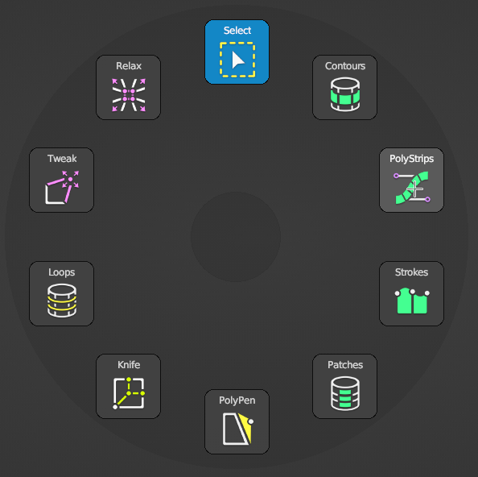
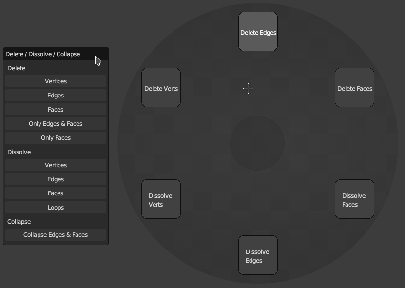

# General Help

Help Shortcut: {{ site.data.keymaps.general_help }}

When RetopoFlow Mode is enabled, certain shortcuts are available regardless of the tool selected.
For tool-specific help, select the tool from the Tools panel, and either press {{ site.data.keymaps.tool_help }} or click Tool Help.

View the [table of contents](table_of_contents.md) for all built-in documentation by pressing {{ site.data.keymaps.all_help }} at any time.

Below is a brief description of some of the features in RetopoFlow.
For more details, see the tooltips when hovering or the product documentation page.

## RetopoFlow Shortcuts

  
| :--- | :--- | :--- |
| {{ site.data.keymaps.done }}, {{ site.data.keymaps.done_alt0 }} | : | quit RetopoFlow |
| {{ site.data.keymaps.blender_save }}   | : | save blend file (same as Blender's save) |
| {{ site.data.keymaps.general_help }}   | : | view general help (this document) |
| {{ site.data.keymaps.all_help }}       | : | view all help documents (table of contents) |
| {{ site.data.keymaps.tool_help }}      | : | view help for currently selected tool |
| {{ site.data.keymaps.toggle_ui }}      | : | toggle on/off main RF windows |

## Tool Shortcuts

Pressing the tool's shortcut will automatically switch to that tool.
The shortcuts for each tool is a number at top of keyboard (not numpad numbers).

    |
| :--- | :--- | :--- | :--- |
| {{ site.data.keymaps.contours_tool }}   | : | Contours | [help](contours.md) |
| {{ site.data.keymaps.polystrips_tool }} | : | PolyStrips | [help](polystrips.md) |
| {{ site.data.keymaps.strokes_tool }}    | : | Strokes | [help](strokes.md) |
| {{ site.data.keymaps.patches_tool }}    | : | Patches | [help](patches.md) |
| {{ site.data.keymaps.polypen_tool }}    | : | PolyPen | [help](polypen.md) |
| {{ site.data.keymaps.loops_tool }}      | : | Loops | [help](loops.md) |
| {{ site.data.keymaps.tweak_tool }}      | : | Tweak | [help](tweak.md) |
| {{ site.data.keymaps.relax_tool }}      | : | Relax | [help](relax.md) |

Note: selection and the undo stack is maintained between tools.

Press {{ site.data.keymaps.pie_menu }} at any time to show the tool pie menu.

## Universal Shortcuts

The following shortcuts work across all the tools, although each tool may have a distinct way of performing the action.
For example, pressing `G` in Contours will slide the selected loop.

  
| :--- | :--- | :--- |
| {{ site.data.keymaps.insert }}                            | : | create new geometry with current tool / apply relax or tweak |
| {{ site.data.keymaps.select_single }}, {{ site.data.keymaps.select_single_add }}  | : | select single |
| {{ site.data.keymaps.select_paint }}, {{ site.data.keymaps.select_paint_add }}    | : | selection painting |
| {{ site.data.keymaps.select_smart }}, {{ site.data.keymaps.select_smart_add }}    | : | smart selection |
| {{ site.data.keymaps.select_all }}                        | : | select / deselect all |
| {{ site.data.keymaps.deselect_all }}                      | : | deselect all |
| {{ site.data.keymaps.select_invert }}                     | : | invert selection |
| {{ site.data.keymaps.action }}                            | : | transform selection when mouse hovers selected geometry |
| {{ site.data.keymaps.grab }}                              | : | grab and move selected geometry |
| {{ site.data.keymaps.rotate }}                            | : | rotate selected geometry |
| {{ site.data.keymaps.scale }}                             | : | scale selected geometry |
| {{ site.data.keymaps.smooth_edge_flow }}                  | : | smooths edge flow of selected geometry |
| {{ site.data.keymaps.delete }}                            | : | delete / dissolve dialog |
| {{ site.data.keymaps.delete_pie_menu }}                   | : | delete / dissolve pie menu
| {{ site.data.keymaps.blender_undo }}                      | : | undo |
| {{ site.data.keymaps.blender_redo }}                      | : | redo |

Pressing {{ site.data.keymaps.delete }} will bring up the Delete/Dissolve dialog, allowing you to delete/dissolve the selected geometry.
Pressing and holding {{ site.data.keymaps.delete_pie_menu }} will bring up a Delete/Dissolve pie menu, which has fewer options than the dialog but is generally faster.

## General Options

The UI Scale option controls how large or small RetopoFlow will draw things.
Larger numbers produce larger fonts, thicker lines, larger vertices, etc.

If the Auto Hide Tool Options is checked, the options for the currently selected tool will be shown, but all other tool options will be hidden.

<!-- The Maximize Area button will make the 3D view take up the entire Blender window, similar to pressing `Ctrl+Up` / `Shift+Space` / `Alt+F10`. -->

### Target Cleaning

The Snap Verts buttons will snap either All vertices or only Selected vertices to the nearest point on the source meshes.

The Merge by Distance will merge vertices into a single vertex if they are within a given distance.

### View Options

The Clipping options control the near and far clipping planes.

The Theme option changes the color of selected geometry.

The Target Drawing options control the rendering of the target mesh.
The Above and Below options control transparency of the target mesh.
Vertex Size and Edge Size control how large the vertices and how think the edges are.

## Symmetry Options

The X, Y, Z checkboxes turn on/off symmetry or mirroring along the X, Y, Z axes.
Note: symmetry utilizes the mirror modifier.

When symmetry is turned on, the mirroring planes can be visualized on the sources choosing either the Edge or Face option.
The Effect setting controls the strength of the visualization.