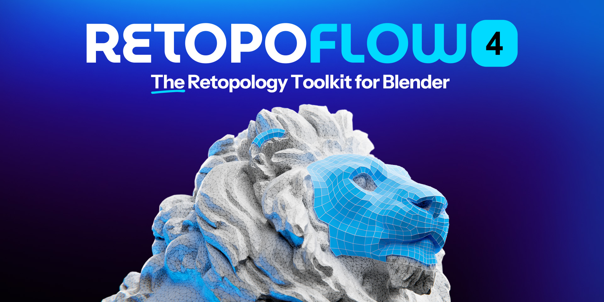

# Welcome!

Retopoflow is a suite of fun, sketch-based retopology tools for Blender, created by [Orange Turbine](https://orangeturbine.com), that generate geometry which snaps to the surface of your high poly objects.

You can read about the features and purchase a copy on [Superhive](https://superhivemarket.com/products/retopoflow?ref=806) (formerly Blender Market).

If you’re brand new to Retopoflow, check the [Quick Start page](/v4/quick_start.html).

Another great place to learn the tools is our [YouTube channel](https://www.youtube.com/@orangeturbine).

We also have a full course on using Retopoflow, which is available for free [on CG Cookie](https://cgcookie.com/courses/retopology-with-retopoflow-4).

## Previous Versions

Retopoflow has been completely refactored in version 4, and this documentation has been updated to match. For information on how to use version 3, switch to the previous docs by using the dropdown on the left.

Even though we will not be adding new featues to it, Retopoflow 3 will still be supprted for at least two years after the official launch of Retopoflow 4.

If you've already purchased Retopoflow 3 on Superhive, you can get version 4 for 25% off (including on top of the reduced price during beta) by using the coupoon code **retopoflow-og**.

## Getting Support

You can get help with an issue or give feedback by reaching out to us in one of the following ways:

- Get high priority support from Orange Turbine by sending a message from your [Superhive inbox](https://superhivemarket.com/inbox) once you've purchased a copy.
- Create a new [issue](https://github.com/CGCookie/retopoflow/issues/new/choose) on Retopoflow's [GitHub page](https://github.com/CGCookie/retopoflow).
- Reach out to us via email at [retopoflow@cgcookie.com](mailto:retopoflow@cgcookie.com).

Please provide as much information and detail as possible, such as steps to reproduce the issue, what behavior you expected to see vs what you actually saw, screenshots, and so on.

See the [Debugging](/v4/debugging.html) page for details on getting as much useful information as possible. Also, if possible, please consider sending us the `.blend` file.

## Thank you!

Retopoflow has been a passion project since 2013 and is what originally convinced us we should create a [marketplace](https://blendermarket.com/) for Blender tools, so that other creators could also work on their passion projects in a sustainable way. We're deeply thankful to the Blender community and, because of projects like this, are able to give back to help make it better for everybody. We are some of the biggest toplogy nerds in the world and are thrilled to be able to continue to innovate in this area because of your continued support.

Happy modeling!

~ Jonathan Williamson, Dr. Jon Denning, Jonathan Lampel, and JF Matheu
