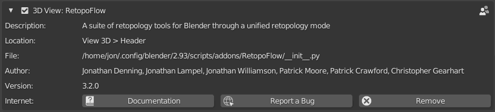

## Intro

RetopoFlow is a suite of Blender tools that automatically generate geometry which snaps to your source objects as you draw on the surface. This documentation covers the installation and usage of all tools included in the add-on.

You can purchase a copy of RetopoFlow [on the Blender Market](https://blendermarket.com/products/retopoflow). 

If you’re brand new to RetopoFlow, check the Quick Start page. Otherwise, jump right over to the Tools section.

## Requirements

RetopoFlow v3.x requires Blender 2.83 or newer and will work on any operating system Blender supports.

## Installing

You may download RetopoFlow from your account dashboard on the Blender Market, assuming you’ve already purchased it.

The easiest way to install RetopoFlow is to do so directly from Blender. You can do this by going to `File > User Preferences > Add-ons > Install`. This will open a File Browser in Blender, allowing to you navigate to and select the .zip file you downloaded. If you are using Blender 2.8+, please make sure that the .zip you select is labeled RetopoFlow 3 and **not** RetopoFlow 2. Press Install from file.

_If your browser auto-extracted the downloaded .zip file then you will need to re-compress the **RetopoFlow** folder before installing._

Once installed, Blender should automatically filter the addons list to show only RetopoFlow. You can then enable the add-on by clicking the checkbox on the upper right of the add-on panel.

If you have any issues with installing, please try the following steps:

* Download RetopoFlow version 3 from the Blender Market (not RetopoFlow version 2, which only works with Blender 2.79 and before).
* Open Blender 2.83 or later
* Head to Preferences / Addons and search for RetopoFlow
* Expand and press Remove
* Restart Blender to completely clear out the previous version
* Head to your preferences again
* Click Install
* Navigate to your RetopoFlow 3 .zip file (please do not unzip)
* Click Install Addon
* Enable RetopoFlow

## Updating
RetopoFlow 3 comes with a built-in updater. Once you've installed it the first time, simply check for updates using the RetopoFlow menu. If you need to update the addon manually for any reason, please be sure to uninstall the old version and restart Blender before installing the new version.   

## Getting Support

Running into a problem or have a question that the documentation isn’t answering? Reach out to us via retopoflow@cgcookie.com.

