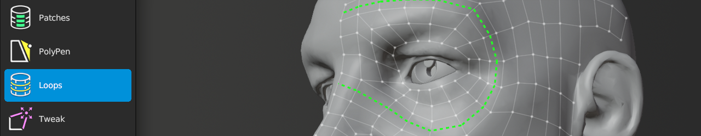

#  Loops Help

Shortcut: {{ site.data.keymaps.loops_tool }}

The Loops tool allows you to insert new edge loops along a face loop and slide any edge loop along the source mesh.
The Loops tool also works on any strip of edges.

## Creating

| :--- | :--- | :--- |
| {{ site.data.keymaps.insert }} | : | insert edge loop |

## Selecting

| :--- | :--- | :--- |
| {{ site.data.keymaps.select_single }}, {{ site.data.keymaps.select_single_add }} | : | select edges |
| {{ site.data.keymaps.select_smart }}, {{ site.data.keymaps.select_smart_add }}   | : | smart select loop |
| {{ site.data.keymaps.select_paint }}, {{ site.data.keymaps.select_paint_add }}   | : | paint edge selection |
| {{ site.data.keymaps.select_all }}                       | : | select / deselect all |
| {{ site.data.keymaps.deselect_all }}                     | : | deselect all |

## Transforming

| :--- | :--- | :--- |
| {{ site.data.keymaps.slide }}  | : | slide loop |
| {{ site.data.keymaps.action }} | : | if mouse over unselected geometry, smart select loop under mouse.   grab and slide selected geometry under mouse |
| {{ site.data.keymaps.smooth_edge_flow }} | : | smooths edge flow of selected geometry |