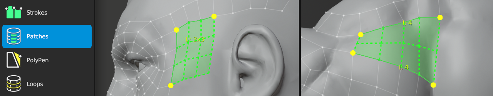

#  Patches Help

Shortcut: {{ keymaps.patches_tool }}

The Patches tool helps fill in holes in your topology.
Select the strip of boundary edges that you wish to fill.

## Creating

|  |  |  |
| :--- | :--- | :--- |
| {{ keymaps.action_alt1 }}    | : | toggle vertex as a corner |
| {{ keymaps.fill }}           | : | create visualized patch |
| {{ keymaps.increase_count }} | : | increase segment count when bridging |
| {{ keymaps.decrease_count }} | : | decrease segment count when bridging |

## Selecting

|  |  |  |
| :--- | :--- | :--- |
| {{ keymaps.select_single }}, {{ keymaps.select_single_add }} | : | select edge |
| {{ keymaps.select_smart }}, {{ keymaps.select_smart_add }}   | : | smart select boundary edges |
| {{ keymaps.select_paint }}, {{ keymaps.select_paint_add }}   | : | paint edge selection |
| {{ keymaps.select_all }}                       | : | select / deselect all |
| {{ keymaps.deselect_all }}                     | : | deselect all |

## Transforming

|  |  |  |
| :--- | :--- | :--- |
| {{ keymaps.action }}  | : | grab and move selected geometry under mouse |
| {{ keymaps.grab }}    | : | grab and move selected geometry |

## Notes

The Patches tool currently only handles a limited number of selected regions.
More support coming soon!

- 2 connected strips in an L-shape
- 2 parallel strips: the two strips must contain the same number of edges
- 3 connected strips in a C-shape: first and last strips must contain the same number of edges
- 4 strips in a rectangular loop: opposite strips must contain the same number of edges

If no pre-visualized regions show after selection, no geometry will be created after pressing {{ keymaps.fill }}.

Adjust the Angle parameter to help Patches determine which connected edges should be in the same strip.
Alternatively, you can manually toggle vertex corners using {{ keymaps.action_alt0 }}.