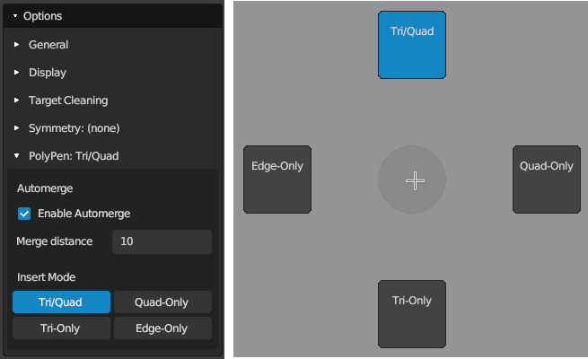

#  PolyPen Help

Shortcut: {{ site.data.keymaps.polypen_tool }}

The PolyPen tool provides absolute control for creating complex topology on a vertex-by-vertex basis (e.g., low-poly game models).
This tool lets you insert vertices, extrude edges, fill faces, and transform the subsequent geometry all within one tool and in just a few clicks.

## Creating

|  |  |  |
| :--- | :--- | :--- |
| {{ site.data.keymaps.insert }} | : | insert geometry connected to selected geometry |

## Selecting

|  |  |  |
| :--- | :--- | :--- |
| {{ site.data.keymaps.select_single }}, {{ site.data.keymaps.select_single_add }} | : | select geometry |
| {{ site.data.keymaps.select_paint }}, {{ site.data.keymaps.select_paint_add }}   | : | paint geometry selection |
| {{ site.data.keymaps.select_all }}                       | : | select / deselect all |
| {{ site.data.keymaps.deselect_all }}                     | : | deselect all |

## Transforming

|  |  |  |
| :--- | :--- | :--- |
| {{ site.data.keymaps.grab }}             | : | grab and move selected geometry |
| {{ site.data.keymaps.action }}           | : | grab and move selected geometry under mouse |
| {{ site.data.keymaps.smooth_edge_flow }} | : | smooths edge flow of selected geometry |

## Other

|  |  |  |
| :--- | :--- | :--- |
| {{ site.data.keymaps.delete }} | : | delete/dissolve selected |

## Insertion Modes

Creating vertices/edges/faces is dependent on the selected mode and the selected geometry.
Switch between modes using the PolyPen Options, or hold {{ site.data.keymaps.pie_menu_alt0 }} to bring up a the PolyPen pie menu.

### Triangle/Quad Insert Mode

The Tri/Quad mode is the normal mode for PolyPen.

- When nothing is selected, a new vertex is added.
- When a single vertex is selected, an edge is added between mouse and selected vertex.
- When an edge is selected, a triangle is added between mouse and selected edge.
- When a triangle is selected, a vertex is added to the triangle, turning the triangle into a quad

Selecting an edge and clicking onto another edge will create a quad in one step.

### Quad-Only Insert Mode

The Quad-Only mode reduces the number of clicks for creating a strip of quads.

- When nothing is selected, a new vertex is added.
- When a single vertex is selected, an edge is added between mouse and selected vertex.
- When an edge is selected, an edge is added centered on the mouse, and a quad is added between the selected and newly added edges.

Selecting an edge and clicking onto another edge will create a quad in one step.

### Triangle-Only Insert Mode

The Tri-Only mode is similar to the Tri/Quad mode, except without the step that turns the selected triangle into a quad.

- When nothing is selected, a new vertex is added.
- When a single vertex is selected, an edge is added between mouse and selected vertex.
- When an edge is selected, a triangle is added between mouse and selected edge.

### Edge-Only Insert Mode

The Edge-Only mode inserts only edges.

- When nothing is selected, a new vertex is added.
- When a single vertex is selected, an edge is added between mouse and selected vertex.

### Knife Mode

The Knife mode allows you to cut into the existing geometry similarly to Blender's Knife tool.
Note: PolyPen in knife mode will only cut into existing geometry; it will not create new vertices, edges, or faces.

- When nothing is selected and mouse is hovering a face, a new vertex is added.
- When nothing is selected and mouse is not hovering a face, the knife starting point is set to the current mouse position.
- When a single vertex is selected or starting point is set, vertices and edges are cut into existing geometry, and existing faces are split accordingly.
- Releasing all inserting keys or deselecting all geometry will start a new knife cut session.

## Additional Tips

The PolyPen tool can be used like a knife, cutting vertices into existing edges for creating new topology routes.