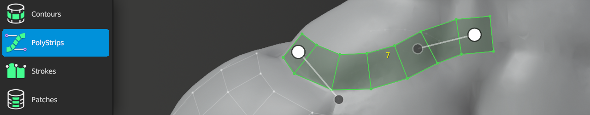

#  PolyStrips Help

Shortcut: {{ site.data.keymaps.polystrips_tool }}

The PolyStrips tool provides quick and easy ways to map out key face loops for complex models.
For example, if you need to retopologize a human face, creature, or any other complex organic or hard-surface object.

PolyStrips works by hand drawing strokes on to the high-resolution source object.
The strokes are instantly converted into spline-based strips of polygons.

Any continuous quad strip may be manipulated with PolyStrips via the auto-generated spline handles.

## Creating

  
| :--- | :--- | :--- |
| {{ site.data.keymaps.insert }}         | : | draw strip of quads |
| {{ site.data.keymaps.brush_radius }}   | : | adjust brush size |
| {{ site.data.keymaps.action }}         | : | grab and move selected geometry |
| {{ site.data.keymaps.increase_count }} | : | increase segment counts in selected strip |
| {{ site.data.keymaps.decrease_count }} | : | decrease segment counts in selected strip |

## Selecting

  
| :--- | :--- | :--- |
| {{ site.data.keymaps.select_single }}, {{ site.data.keymaps.select_single_add }} | : | select face |
| {{ site.data.keymaps.select_paint }}, {{ site.data.keymaps.select_paint_add }}   | : | paint face selection |
| {{ site.data.keymaps.select_all }}                       | : | select / deselect all |
| {{ site.data.keymaps.deselect_all }}                     | : | deselect all |

## Control Points

The following actions apply to when the mouse is hovering over control points of selected strip.

  
| :--- | :--- | :--- |
| {{ site.data.keymaps.action }}      | : | grab and move control point under mouse |
| {{ site.data.keymaps.action_alt0 }} | : | grab and move all inner control points around neighboring outer control point |
| {{ site.data.keymaps.action_alt1 }} | : | scale strip width by dragging on inner control point |

## Transforming

  
| :--- | :--- | :--- |
| {{ site.data.keymaps.action }}  | : | grab and move selected geometry under mouse |
| {{ site.data.keymaps.grab }}    | : | grab and move selected geometry |

## Other

  
| :--- | :--- | :--- |
| {{ site.data.keymaps.delete }} | : | delete/dissolve selected |