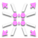
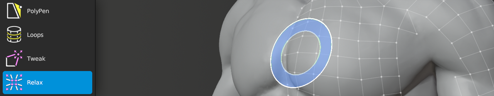

#  Relax Help

Shortcut: {{ site.data.keymaps.relax_tool }}

The Relax tool allows you to easily relax the vertex positions using a brush.

## Transforming

|  |  |  |
| :--- | :--- | :--- |
| {{ site.data.keymaps.brush }}          | : | relax all vertices within brush |
| {{ site.data.keymaps.brush_alt }}      | : | relax only selected vertices within brush |

## Changing Brush Options

|  |  |  |
| :--- | :--- | :--- |
| {{ site.data.keymaps.brush_radius }}   | : | adjust brush size |
| {{ site.data.keymaps.brush_strength }} | : | adjust brush strength |
| {{ site.data.keymaps.brush_falloff }}  | : | adjust brush falloff |

## Masking

Relax has several options to control which vertices are or are not moved.
Each option is below, along with setting and description.

### Boundary

|  |  |  |
| :--- | :--- | :--- |
| Exclude  | : | Relax vertices not along boundary |
| Include  | : | Relax all vertices within brush, regardless of being along boundary |

### Symmetry

|  |  |  |
| :--- | :--- | :--- |
| Exclude  | : | Relax vertices not along symmetry plane |
| Maintain | : | Relax vertices along symmetry plane, but keep them on symmetry plane |
| Include  | : | Relax all vertices within brush, regardless of being along symmetry plane |

### Hidden

|  |  |  |
| :--- | :--- | :--- |
| Exclude  | : | Relax only visible vertices |
| Include  | : | Relax all vertices within brush, regardless of visibility |

### Selected

|  |  |  |
| :--- | :--- | :--- |
| Exclude  | : | Relax only unselected vertices |
| Only     | : | Relax only selected vertices |
| All      | : | Relax all vertices within brush, regardless of selection |