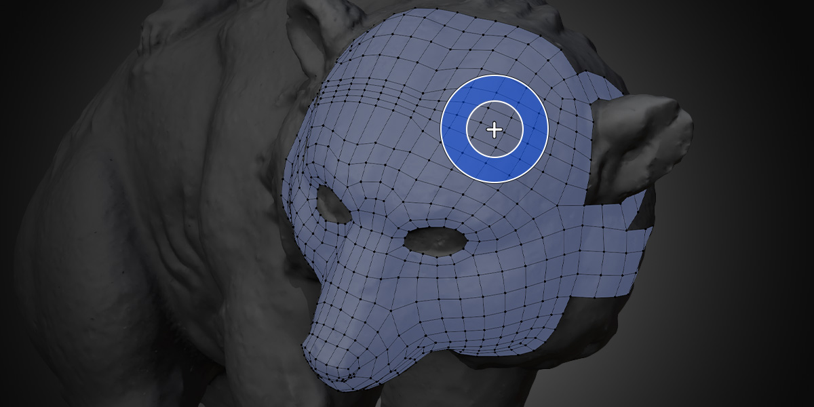

#  Relax Brush

<!--
Quick Shortcut: {{ site.data.keymaps.relax_quick }}
-->

The Relax Brush tool allows you to easily and interactively smooth out vertex positions while keeping them on the surface of the source mesh.

## Transforming

To use the Relax Brush, simply `Left Click Drag` on vertices. Which vertices are affected can be controlled in the **Masking** settings.

## Brush Settings

- **Radius** controls the size of the brush and can be adjusted with the hotkey `F`
- **Strength** controls how much the brush effects the geometry and can be adjusted with the hotkey `Shift F`
- **Falloff** controls how much the strength of the brush is feathered near the edges and can be adjusted with the hotkey `Ctrl F`

<!--
These options can also be stored as presets in the Brush Options panel.
To quickly switch between presets, use the {{ site.data.keymaps.pie_menu_alt0 }} pie menu.
-->

## Masking Settings

The Relax Brush has several options to control which vertices are moved and how.

**Boundary**
- **Exclude** does not affect vertices along the mesh boundary.
- **Slide** moves vertices along boundary but only by sliding them along the boundary loop.
- **Include** moves all vertices under the brush including those along the boundary.

<!--
### Symmetry
- **Exclude**: Do not affect vertices along the symmetry plane.
- **Slide**: Tweak vertices along boundary but only by sliding them along the symmetry plane.
- **Include**: Tweak all vertices under the brush including those along the symmetry plane.
-->

**Selected**
- **Exclude** moves only unselected vertices.
- **Only** moves only selected vertices.
- **All** moves all vertices within brush regardless of selection.

**Occluded**
- **Exclude** moves only unoccluded vertices.
- **Include** moves all vertices within brush regardless of occlusion.

## Algorithm Settings

**Iterations** determines how many times the relax algorithm is run per update. A higher value leads to more agressive smoothing. It is recommended to try increasing the brush strength before increasing this setting.

**Strength** multiplies how much each iteration affects the result.

**Average Edge Lengths** enables adjusting the length of edges to move towards the average edge length under the brush.

**Average Face Radius** enables adjusting the length of edges so that each face's radius moves towards the average of all face radii under the brush.

**Average Face Angles** enables moving vertices so that the angle of each corner of each face moves towards the same value.

**Average Face Lengths** enables adjusting the length of edges to move towards the average length of all edges that share the same face. This option is still experimental and can cause faces to flip.

**Straighten Edges** enables moving vertices so that their edge loops straighten out.

**Correct Flipped Faces** attempts to make sure the direction of the face normals under the brush are consistent.

## Selection

Even though `Left Click` to select is not available while using the Tweak Brush, you can still select and deselect by using `Shift Left Click`. Box Select `B` and Lasso Select `Ctrl Right Mouse Drag` are always available as well. 