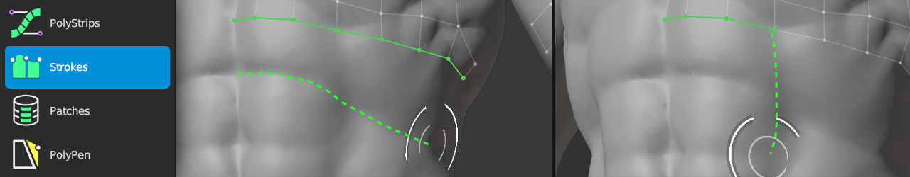
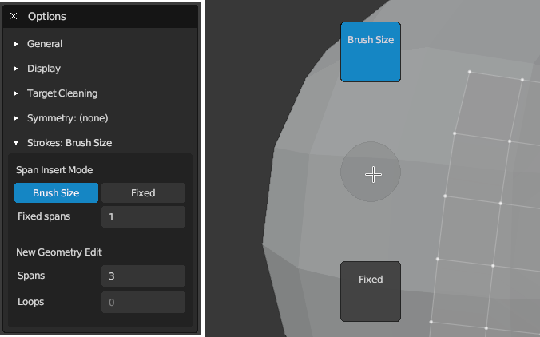

#  Strokes Help 

Shortcut: {{ site.data.keymaps.strokes_tool }}

The Strokes tool helps fill in holes in your topology.
This tool lets you insert edge strips and extruding edges by brushing a stroke on the source.

## Creating

  
| :--- | :--- | :--- |
| {{ site.data.keymaps.insert }}         | : | insert edge strip and bridge from selected geometry |
| {{ site.data.keymaps.increase_count }} | : | increase span/loop counts in bridge |
| {{ site.data.keymaps.decrease_count }} | : | decrease span/loop counts in bridge |

## Selecting

  
| :--- | :--- | :--- |
| {{ site.data.keymaps.select_single }}, {{ site.data.keymaps.select_single_add }} | : | select edges |
| {{ site.data.keymaps.select_smart }}, {{ site.data.keymaps.select_smart_add }}   | : | smart select loop |
| {{ site.data.keymaps.select_paint }}, {{ site.data.keymaps.select_paint_add }}   | : | paint edge selection |
| {{ site.data.keymaps.select_all }}                       | : | select / deselect all |
| {{ site.data.keymaps.deselect_all }}                     | : | deselect all |

## Transforming

  
| :--- | :--- | :--- |
| {{ site.data.keymaps.action }}        | : | grab and slide selected geometry under mouse |
| {{ site.data.keymaps.grab }}          | : | slide selected loop |

## Other

  
| :--- | :--- | :--- |
| {{ site.data.keymaps.delete }}         | : | delete/dissolve selected |

## Span Insertion Modes

When extruding a strip, you can specify the number of spans to create using two different modes: Brush Size and Fixed.
Switch between span insert modes using the Strokes Options, or hold {{ site.data.keymaps.pie_menu_alt0 }} to bring up a the Strokes pie menu.

If the Span Insert Mode is set to Brush Size, the number of spans will be created to have a size approximately the size of the brush.
This means that a smaller brush will insert more, smaller spans, and a larger brush will insert fewer, larger spans.

If the Span Insert Mode is set to Fixed, the number of spans will be exactly equal to the number specified by Fixed spans.

## Tips

Creating geometry is dependent on your selection:

- When nothing is selected, a new edge strip is added
- When an edge strip is selected and stroke is not a loop, the selected edge strip is extruded to the stroke as a span
- When an edge loop is selected and stroke is a loop, the selected edge loop is extruded to the stroke as a loop

Note: only edges on boundary of target are considered in selection.

If stroke starts or ends on existing vertex, the Strokes tool will try to bridge the extruded geometry.