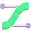
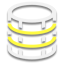

# Table of Contents

Help Shortcut: {{ site.data.keymaps.all_help }}

Below are links to all of the help documents built into RetopoFlow.

## General

The following documents provide help generally across all of RetopoFlow.

- [Quick Start Guide](quick_start.md)
- [A Welcome to You from Us](welcome.md)
- [RetopoFlow FAQ](faq.md)
- [General Hotkeys and Options](general.md)

## Tools

The following documents provide help for specific RetopoFlow tools.

-  [Select](select.md)
-  [Contours](contours.md)
-  [PolyStrips](polystrips.md)
-  [Strokes](strokes.md)
-  [Patches](patches.md)
-  [PolyPen](polypen.md)
-  [Knife](knife.md)
-  [Loops](loops.md)
-  [Tweak](tweak.md)
-  [Relax](relax.md)

## Additional Information

The following links provide additional information.

- [Change list](changelist.md)
- [Warnings Details](warnings.md)
- Blender Market: [RetopoFlow](https://blendermarket.com/products/retopoflow)
- Twitter: [RetopoFlow](https://twitter.com/RetopoFlow), [RetopoFlow Dev](https://twitter.com/RetopoFlow_Dev)
- GitHub: [Issues](https://github.com/CGCookie/retopoflow/issues)

The following provide additional information about more advanced RetopoFlow features.

- [Debbuging](debugging.md)
- [Updater System](addon_updater.md)
- [Keymap Editor](keymap_editor.md)

