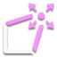
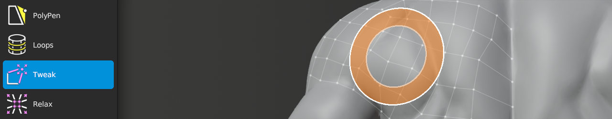

#  Tweak Help

Shortcut: {{ site.data.keymaps.tweak_tool }}

The Tweak tool allows you to easily adjust vertex positions with a brush.

## Transforming

  
| :--- | :--- | :--- |
| {{ site.data.keymaps.brush }}          | : | tweak all vertices within brush |
| {{ site.data.keymaps.brush_alt }}      | : | tweak only selected vertices within brush |

## Changing Brush Options

  
| :--- | :--- | :--- |
| {{ site.data.keymaps.brush_radius }}   | : | adjust brush size |
| {{ site.data.keymaps.brush_strength }} | : | adjust brush strength |
| {{ site.data.keymaps.brush_falloff }}  | : | adjust brush falloff |

## Masking

Tweak has several options to control which vertices are or are not moved.
Each option is below, along with setting and description.

### Boundary

  
| :--- | :--- | :--- |
| Exclude  | : | Tweak vertices not along boundary |
| Include  | : | Tweak all vertices within brush, regardless of being along boundary |

### Symmetry

  
| :--- | :--- | :--- |
| Exclude  | : | Tweak vertices not along symmetry plane |
| Maintain | : | Tweak vertices along symmetry plane, but keep them on symmetry plane |
| Include  | : | Tweak all vertices within brush, regardless of being along symmetry plane |

### Hidden

  
| :--- | :--- | :--- |
| Exclude  | : | Tweak only visible vertices |
| Include  | : | Tweak all vertices within brush, regardless of visibility |

### Selected

  
| :--- | :--- | :--- |
| Exclude  | : | Tweak only unselected vertices |
| Only     | : | Tweak only selected vertices |
| All      | : | Tweak all vertices within brush, regardless of selection |