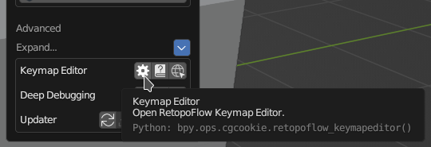
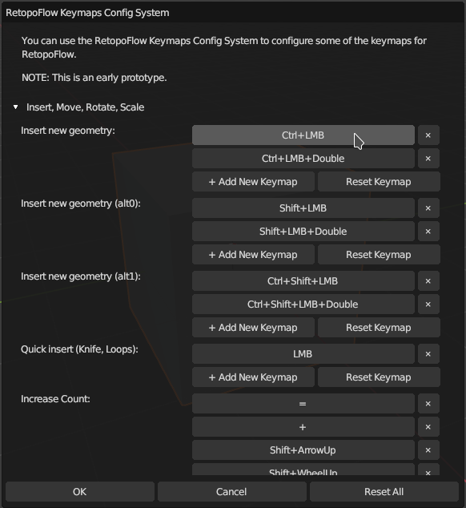
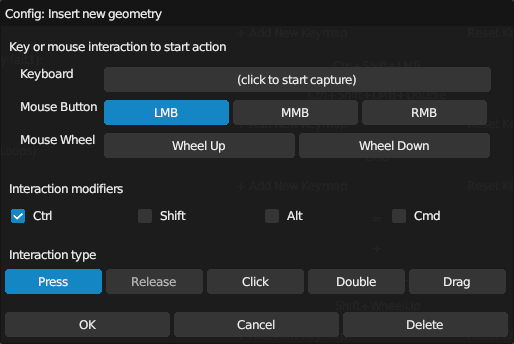

# RetopoFlow Keymap Editor

RetopoFlow has a very basic keymap editor to allow some customization of interaction.

Start the editor by clicking the Keymap button in the Config section of the RetopoFlow Blender menu.

IMPORTANT: This editor is an early prototype, and not all keymap settings will work as expected.

Navigate the action categories to find lists of actions, each with a set of interactions that can be customized.

- Click on the big button with interactions as text (example: Ctrl+LMB) will edit that specific interaction for the RetopoFlow action.
- Click on the button with a `✕` to delete that interaction.
- Click the `+ Add New Keymap` to add a new interaction for the action.
- Click the `Reset Keymap` button to reset that action's keymaps to the default interactions.
- Click the `Reset All` button at the bottom to reset _all_ of the custom keymaps back to their default interactions.

When editing an interaction, a window will display with all the ways to map an interaction to the action.

