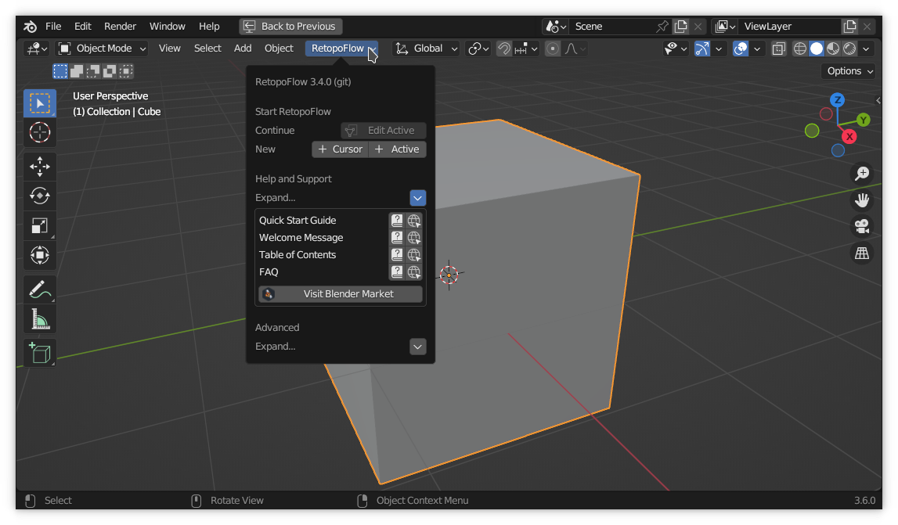

# RetopoFlow Quick Start Guide

This guide will help you get started with RetopoFlow {[rf version]}. More detailed help is available by pressing {{general help}} after you start RetopoFlow. 

You can also watch the full RetopoFlow 3 course for free on CG Cookie: 
[cgcookie.com/courses/retopology-with-retopoflow-3](https://cgcookie.com/courses/retopology-with-retopoflow-3)

## The Short, Short Version

To start retopologizing for the first time:

1. Switch to Object mode
2. Click on the "RetopoFlow" menu
3. Either click the "+ Cursor" or "+ Active" buttons next to "New"

    - "+ Cursor" will create a new target mesh located and oriented by the 3D Cursor.
    - "+ Active" will create a new target mesh located and oriented by the active source mesh.
    - Note: RetopoFlow follows Blender's convention where symmetry is based on the origin of the object.

To continue working on a previous retopology session:

1. Select the low-poly retopo target mesh
2. Switch to Edit Mode
3. Either click on the triangle over square button next to the "RetopoFlow" menu or choose one of the tools from the dropdown menu

## Other Help

The following documents provide additional help.

- [Table of Contents](table_of_contents.html)
- [A Welcome to You from Us](welcome.html)
- [General RetopoFlow Help](general.html)

## Terminology

|  |  |  |
| --- | --- | --- |
| Source Object(s) | : | The original object(s) that you are re-creating.  These meshes typically have a high polygon count with poor topology and edge flow (ex: result of Dyntopo in Sculpt Mode) |
| Target Object    | : | The new object that stores the retopologized surface.  This mesh typically has a low polygon count with good topology and edge flow. |

## Target and Source Objects

- In RetopoFlow&nbsp;1.x you were required to select the source and target objects explicitly.
- In RetopoFlow&nbsp;2.x you were required to have the target mesh active, selected, and visible, with all other visible meshes considered as sources.
- In RetopoFlow&nbsp;3.x the target mesh is what you are currently editing (Edit Mode), and the source meshes are any other visible mesh.

Any mesh object that is visible and not the target object is considered a source object.
This means that you can hide or move objects to different scenes to change which source objects will be retopologized.

Note: only newly created or edited target geometry will snap to the source, but you can snap the target vertices to the nearest surface point in Options > General > Target Cleaning > Snap Verts.

## RetopoFlow Mode

Notes about earlier version: the tools in RetopoFlow&nbsp;1.x were set of disjointed tools, where you would need to quit one tool in order to start another.
Also, because we wrote RF&nbsp;1.x tools separately, the visualizations and settings were not consistent.
Furthermore, the only indication that a tool was running in RetopoFlow&nbsp;1.x was a small "Click for Help" button in the top-right corner, which is easily missed.

In RetopoFlow&nbsp;2.x, we completely rewrote the framework so that RF acts like any other Blender mode (like Edit Mode, Sculpt Mode, Vertex Paint Mode).
Choosing one of the tools from the RetopoFlow panel will start RetopoFlow Mode with the chosen tool selected.

Although the underlying framework has changed significantly, RetopoFlow&nbsp;3.x uses a similar workflow to RetopoFlow&nbsp;2.x.

When RetopoFlow Mode is enabled, all parts of Blender outside the 3D view will be darkened (and disabled) and windows will be added to the 3D view.
These windows allow you to switch between RF tools, set tool options, and get more information.
Also, a one-time Welcome message will greet you.

