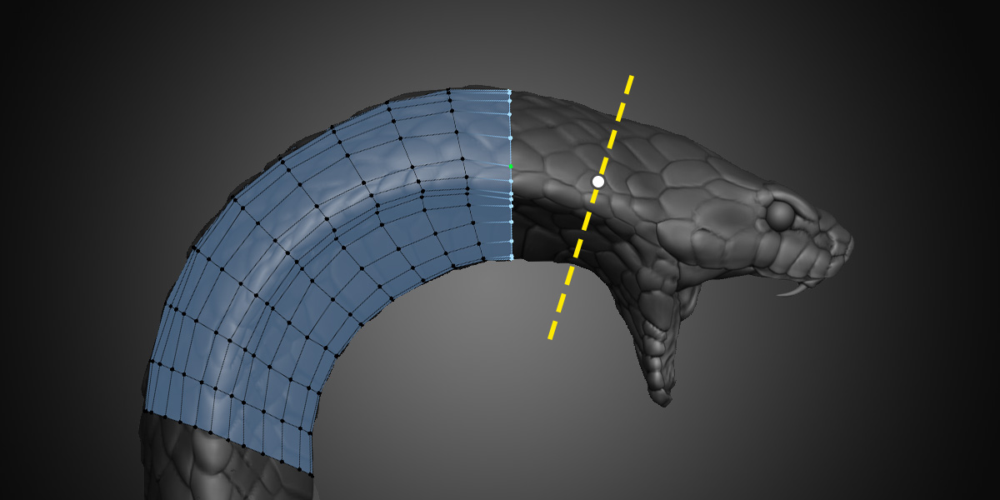

#  Contours

The Contours tool gives you a quick and easy way to retopologize cylindrical forms.
For example, it's ideal for organic forms such as arms, fingers, legs, tentacles, tails, horns, etc.

## Inserting

The tool works by drawing strokes perpendicular to the form to create loops that define the contour or silhouette of the shape.

Hold `Ctrl` and `LMB Drag` across the source geometry to cretate a new cut. The source geometry under the center of the stroke is what gets evaluated. You may draw strokes in any order, from any direction.

- If there is no retopology geometry selected or under the stroke, a new loop will be created.
- If the stroke is over existing geometry, a new cut will be inserted similar to a loop cut.
- If there is a loop selected, a new loop will be created and connected to the selection if possible.

After you create a new loop but before that loop is connected to any other geometry (including another loop), you can adjust the number of vertices in the loop by scrolling with `Ctrl Scroll`.

When you have a loop selected and make a new cut, it will extend the original loop to the new one. The number of loops in between each cut can be adjusted with `Ctrl Scroll`.

You can twist loops around their axis at any time using `Shift Scroll` or `Alt T`.

## Settings

**Spans** is the number of vertices that will be created when adding a new loop that is not connected to any geometry. When extruding or cutting existing geometry, the new loop will have the same number of vertices as the adjacent loops.

**Cuts** is the number of in-between loops inserted during an extrusion. These loops are placed using interpolation and may not wrap the surface as accurately as the main cut.

**Method** is how Contours calculates the shape of the source mesh in order to create a new loop around it.
- **Walk** calculates the faces under the stroke one by one until it complets a loop, ensuring that the shape is fully preserved. This can be slow on extremely dense meshes, and does not work on non-manifold geometry, but is still quite fast and gives the best results in the vast majority of cases. It works great for complex shapes like fingers, where screen-space or raycasting algorithms tend to fail. It also always finds exact corners on hard surface geometry.

- **SDF** walks around the surface using a distance field. This is fairly accurate, fairly quick, and does not slow down at all when the target's polycount is very high. It wraps around disconnected meshes easily and does not care about normals. It's accuracy is determined by the Grid Size and Subdivisions options. If the grid size is too large it will start to jump gaps and miss corner details, and if it is too low it will start to slow down. You can see the initial grid size (before subdivision) as the tick marks on the cut preview.

- **Fast** uses raycasts to find the volume center of the cut and raycasts again from that point in all directions to find the surface. The Sample Width is the spacing of two extra dots visible on the cut preview that are used to triangulate the volume center. For best results, be sure to position all three of those dots over the surface you want to cut. The Ray Depth controls how many surfaces the rays can travel through. This method gives instant results regardless of the target's polycount and can jump over disconnected edges, but it can struggle with complex surfaces and incorrect normals.

**Refinement**, for both the SDF and Fast methods, iteratively divides and re-snaps the worst fitting segments to improve the quality of the result in a fairly efficient manner. The performance hit of refinement passes is only noticible at very high cut counts.

## Selecting

The default selection mode for Contours is Vertex + Edge because it is helpful to be able to quickly select edges and loops while also clearly seeing the number and position of the newly creted vertices.

General selection options for all tools can be read about on the [Retopoflow Mode](general.html) docs page under Selection.

## Transforming

Tweaking's Loops Mode is enabled by default in Contours, so you can quickly slide loops around by simply clicking and dragging on an edge.