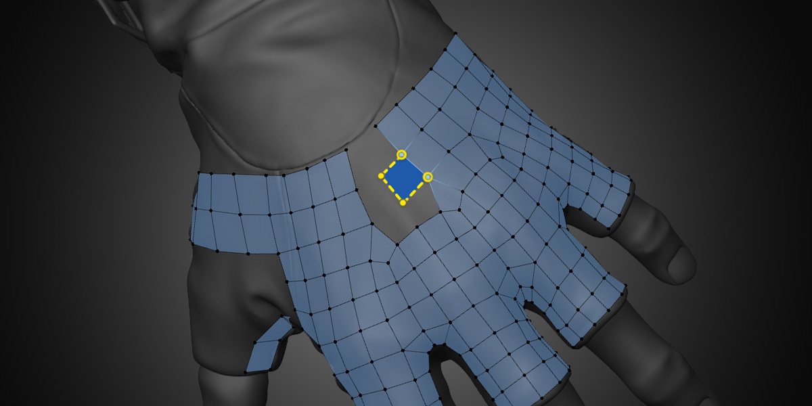

#  PolyPen

The PolyPen tool provides absolute control for creating complex topology on a vertex-by-vertex basis (e.g., low-poly game models).
This tool lets you insert vertices, extrude edges, fill faces, and transform the subsequent geometry all within one tool and in just a few clicks.

## Inserting
<!--
| :--- | :--- | :--- |
| {{ site.data.keymaps.insert }} | : | insert geometry connected to selected geometry |
-->
To create a new vertex using PolyPen, make sure no other retopology geometry is selected and hold `Ctrl` and `LMB` (Left Mouse Click) on the surface of the source geometry.

To follow this guide, keep the **Insert Method** set to **Tri / Quad** for now.

To create an edge, keep just that new vertex selected and `Ctrl LMB` on another part of the surface.

To create a triangle, keep that edge selected or select any other edge and `Ctrl LMB` again.

To turn a triangle into a quad, select it and `Ctrl LMB` one more time to define the fourth corner.

With the **Tri / Quad** method, you can quickly and explicitly define all four corners of a quad and it is the most precise way to work.

However, sometimes you'll want to quickly insert quads in one click. For that, switch the **Insert Method** over to **Quad**. You could also choose **Triangle** to not automatically convert triangles into quads, **Edge** to not create any faces, or **Vertex** to only create vertices that are not connected to anything.

PolyPen can also be used to fill a quad between two edges. To fill in **Tri / Quad** or **Quad** mode, just select one edge, hold `Ctrl` and `LMB` on the second edge. Done! Keep in mind that you can also use Blender's `F` hotkey with any vert or face selected to create a new face with the next closest two vertices.

## Cutting

PolyPen can also be used as a knife. To make a cut, deselect everything and `Ctrl LMB` on an edge or vertex. Then, with that newly created vertex still selected, `LMB` on any edge or vertex that is connected to the same mesh island while continuing to hold `Ctrl`. You can also select any existing vertex or edge before knifing to start the cut from there.

If you select an edge to start from and knife to another edge along the same face loop, PolyPen will insert a partial edge loop instead of a straight cut. This allows you to quickly insert partial loops along curved surfaces.

You can make cuts into the middle of faces and PolyPen will split the face as soon as the cut reaches another side. If the cut does not reach another side, the newly created edges will remain as loose geometry.

PolyPen's knife can automatically insert simple quad junctions if Knife Junctions is enabled in the tool properties. To insert a junction, start a cut on one side of a quad and end the cut on an adjacent side.

You can also always use Blender's knife with the hotkey `K` and then use Retopoflow's [Mesh Cleanup operator](mesh_cleanup.html) on the result to snap the new vertices to the surface of the source object.

## Selecting

The default selection mode for PolyPen is Vertex + Edge so that you can quickly tweak both vertices and edges. However, you can work in just Vertex mode if you find yourself accidentally selecting edges.

General selection options for all tools can be read about on the [Retopoflow Mode](general.html) docs page under Selection.

## Transforming

A `LMB Drag` on components in PolyPen will perform a tweak action similar to Blender's Tweak tool. The tweaking settings are shared across multiple tools and can be read about on the [Retopoflow Mode](general.html) docs page under Common Settings.