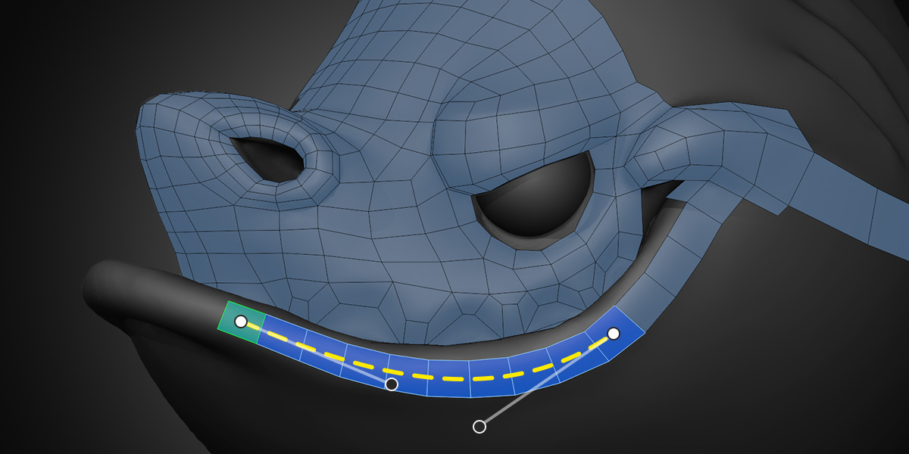

#  PolyStrips

The PolyStrips tool provides quick and easy ways to map out key face loops for complex models, as well as adjust existing strips of faces.

## Inserting

To create a strip of quads with PolyStrips, hold down `Ctrl` and `LMB Drag` on the surface of a source object.

The default size of the quads corresponds to the size of the brush that you see when you hold down `Ctrl`. To adjust the size, use the hotkey `Shift F` or the bracket keys `[` and `]`.

After you've drawn a strip, you'll be able to adjust some of its properties.
- `Ctrl Scroll` changes the segment count
- `Shift Scroll` changes the width

These options are also available in Blender's Adjust Last Operation panel, along with a **Split Angle** property that adjusts how sharp the curve needs to be in order to be considered a corner.

You can change the segment count for any selected strip as long as its sides are not connected to existing topology.

Drawing to or from an existing face will attach the new strip to that face. You can also draw alongside existing boundary edges to attach the side of the new strip to it.

By default, the new strip will inherit it's width from the snapped faces rather than the brush size. This can be changed using the Size Method setting. There, you can choose to always follow the brush size or used a fixed world space distance.

## Selecting

The default selection mode for PolyStrips is Face so that you can quickly select and tweak parts of strips. However, you can work in just Vertex and / or Edge select mode just as well if you prefer.

It's helpful to remember that even though `Ctrl LMB` to select shortest path is blocked because `Ctrl` is used to create strips, you can always do the same thing with `Ctrl Shift LMB`. So to easily select a part of a strip, `LMB` to select one face and then `Ctrl Shift LMB` on another.

General selection options for all tools can be read about on the [Retopoflow Mode](general.html) docs page under Selection.

## Transforming

A `LMB Drag` on components in PolyPen will perform a tweak action similar to Blender's Tweak tool. The tweaking settings are shared across multiple tools and can be read about on the [Retopoflow Mode](general.html) docs page under Common Settings.

PolyStrips also has [Curve Handles](curve_handles.html) enabled by default, which are useful for quickly positioning face loops. Toggling an automatic control point to a vector one (see the [Curve Handles](curve_handles.html) page) with `V` to insert topological corners, or using `Alt Drag` on a control point to adjust the strip width is especially useful with PolyStrips.
