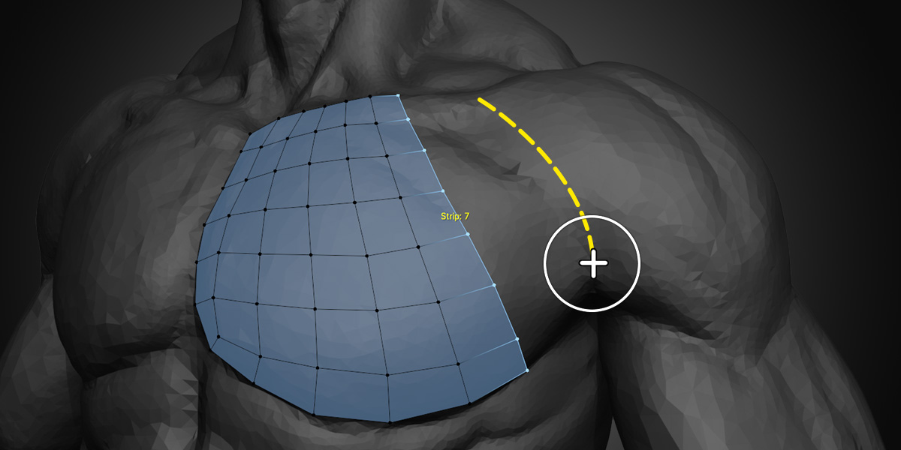
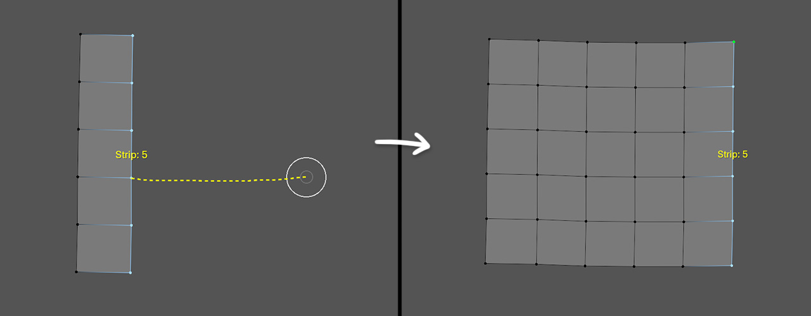
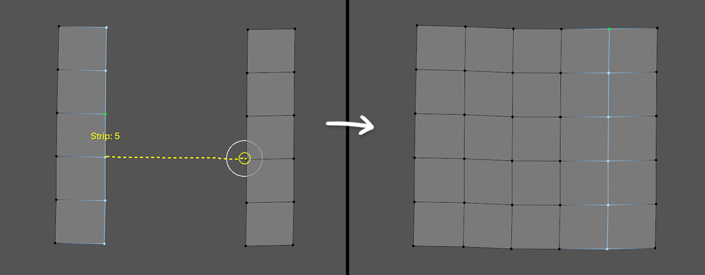
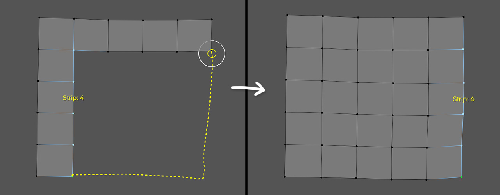
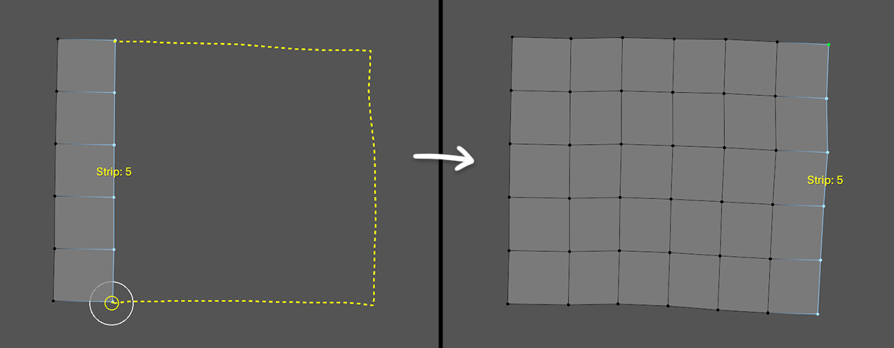
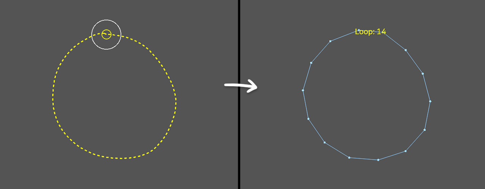
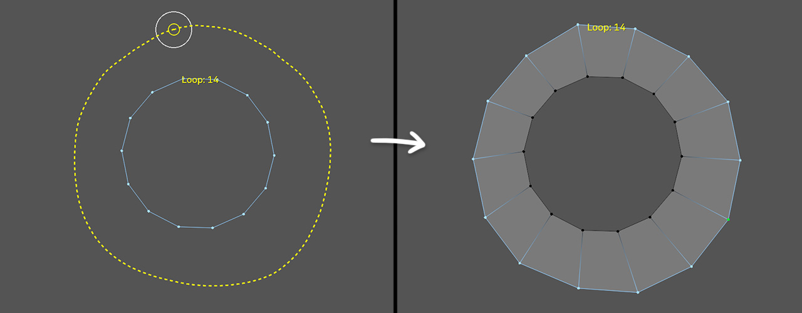

#  Strokes

Strokes is an incredibly versetile tool for quickly sketching out patches of quads and filling holes in the topology.

## Inserting

To draw a new stroke, deselect everything, hold down `Ctrl`, and `LMB Drag` on the surface of the source object.

To turn the previous stroke into a patch of quads, keep the newly created geometry selected and draw a new stroke. Strokes will extrude the selection to the new stroke using evenly spaced quads.

After creating a new or extruded stroke, you can scroll with `Ctrl Mouse Wheel` to increase or decrease the number of interpolated verts or loops.

## Stroke Types

Strokes is context aware and adapts to the current selection, surrounding geometry, and shape of your stroke. The basic stroke types should feel intuitive right away, but diving into the more advanced stroke types will help you to work significantly faster.

You do not need to remember the names of the strokes while working, but they are listed here for clarity. 

### Edge Strip 

A basic Edge Strip is created when you draw a new stroke that is not connected to any other geometry.

### Equals Strip 

An Equals Strip is created when you extrude a set of selected edges by drawing a stroke that does not connect to any existing vertices. For best results, draw the stroke roughly paralell to the selected edges, or draw far enough away from them for the Smoothing setting to crete a nice blend.

You can also create an Equals Strip by selecting a set of edges in a loop and drawing from a deselected vertex in that same loop to the corresponding vertex on the other side of the loop. A yellow circle will appear around the cursor while you hold `Ctrl` to indicate that the stroke will be snapped to a vertex.

*Tip: you can `Ctrl Scroll` to adjust the count even when filling in an area with an Equals Strip.*

### T Strip

A T Strip is created by starting the stroke over any of the selected vertices and drawing perpendicular to the selected edges. This type of strip has a special **Extrapolation** option that determines whether or not the newly created geometry follows the curve of the selected geometry. 

### I Strip

An I Strip is created by starting a stroke from a vertex in the set of selected edges and ending the stroke on another vertex. This is most commonly used for bridging two pieces of disconnected geometry.

### L Strip

An L Strip is created when you draw starting from the end of one selected set of vertices, create a corner, and end on a vertex that is connected to the original selection. 

### C Strip

A C Strip is created by starting a stroke from a vertex on one end of the selected edges and ending the stroke at the vertex on the other end. This allows you to explicitly define every side of the resulting patch for maximum control. The two sharpest angles in the stroke will be interpreted as the other two corners of the patch.

### Loop

A Loop is created by drawing a stroke that ends in the same place that it starts. The yellow circle that indicates vertex snapping will be highlighted when the end of the stroke is close enough to the start to be considered a loop.

### Equals Loop

An Equals Loop is created by drawing a second loop inside or outside a selected loop.

### T Loop

A T Loop is created by drawing a stroke that starts at a vertex in a selected loop and moves inwards or outwards. This can also be used to bridge the loop to an outer or inner loop. 

## Settings

**Count** determines how many vertices or loops are created when inserting a stroke.

- **Fixed** uses a set number. Setting this to zero is an interesting way of quickly drawing quads that do not need to be evenly spaced.

- **Brush Size** uses the Strokes brush, which can be seen while drawing a stroke. Like any other brush in Blender, you can quickly change the size with the hotkey `F`. A smaller brush size will result in more dense geometry and a larger brush size will result in less dense geometry.

- **Average** uses the average width of the selected edges, which automatically gives you as perfectly square quads as possible. When creating a stroke with no edges selected, the brush size is used as a fallback.

**Extrapolation** determines whether or not the newly created geometry follows the curve of the selected geometry when creating T Strips. **Flat** will extrude all of the edges in a straight line while **Adapt** will fan out the edges to maintain the original curvature.

**Smoothing** is the factor for how much smooth blending is applied to the interpolated loops when creating Equals Strips and I Strips. A value of zero creates perfectly straight lines from the starting vertices to the ending vertices.

**Spacing** controls how close together the interpolated loops are near the start and end of the newly created geometry.

## Selecting

The default selection mode for Contours is Vertex + Edge because it is helpful to be able to quickly select edges and loops while also clearly seeing the number and position of the newly creted vertices.

## Transforming

A `LMB Drag` on components in Strokes will perform a tweak action similar to Blender's Tweak tool. The tweaking settings are shared across multiple tools and can be read about on the [Retopoflow Mode](general.html) docs page under Common Settings.

## Limitations

Strokes works in screen space and cannot create geometry past the edge of the source mesh, so drawing a stroke towards the edge of the source mesh can cause some verts to get cut off.