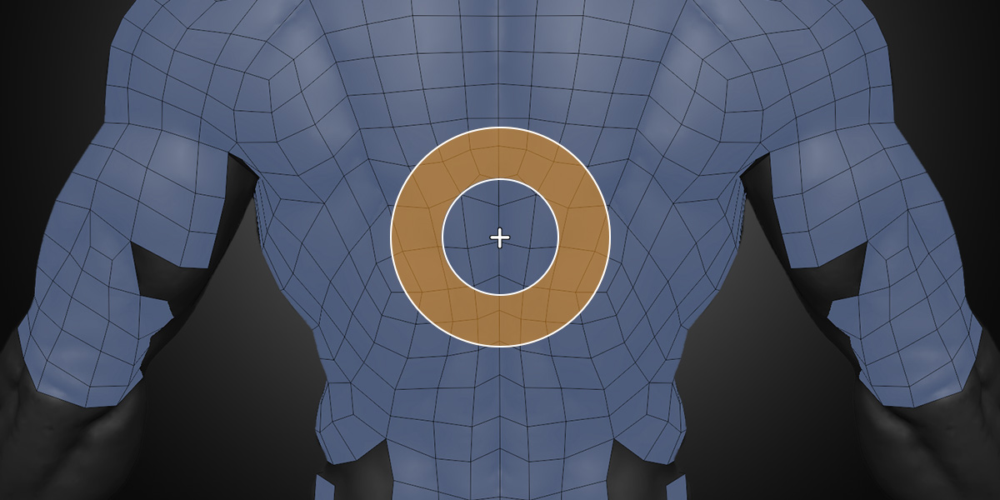

#  Tweak Brush

<!--
Quick Shortcut: {{ site.data.keymaps.tweak_quick }}
-->

The Tweak Brush tool allows you to easily and interactively adjust vertex positions across the surface of the source mesh.

You can quickly use the Tweak tool while in any other Retopoflow tool with `Shift Ctrl LMB Drag`.

## Transforming

To use the Tweak Brush, simply `LMB Drag` on vertices. Which vertices are affected can be controlled in the **Masking** settings.

## Brush Settings

- **Radius** controls the size of the brush and can be adjusted with the hotkey `F`
- **Strength** controls how much the brush effects the geometry and can be adjusted with the hotkey `Shift F`
- **Falloff** controls how much the strength of the brush is feathered near the edges and can be adjusted with the hotkey `Ctrl F`

<!--
These options can also be stored as presets in the Brush Options panel.
To quickly switch between presets, use the {{ site.data.keymaps.pie_menu_alt0 }} pie menu.
-->

## Masking Settings

The Tweak Brush has several options to control which vertices are moved and how.

**Boundary**
- **Exclude** does not affect vertices along the mesh boundary.
- **Slide** moves vertices along boundary but only by sliding them along the boundary loop.
- **Include** moves all vertices under the brush including those along the boundary.

<!--
### Symmetry
- **Exclude**: Do not affect vertices along the symmetry plane.
- **Slide**: Tweak vertices along boundary but only by sliding them along the symmetry plane.
- **Include**: Tweak all vertices under the brush including those along the symmetry plane.
-->

**Selected**
- **Exclude** moves only unselected vertices.
- **Only** moves only selected vertices.
- **All** moves all vertices within brush regardless of selection.

**Occluded**
- **Exclude** moves only unoccluded vertices.
- **Include** moves all vertices within brush regardless of occlusion.

## Selection

Even though `LMB` to select is not available while using the Tweak Brush, you can still select and deselect by using `Shift LMB`. Box Select `B` and Lasso Select `Ctrl Right Mouse Drag` are always available as well. 