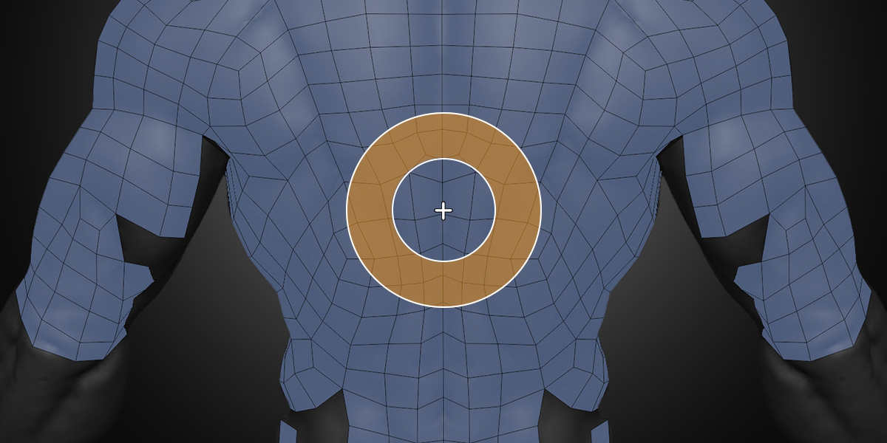

#  Tweak Brush

<!--
Quick Shortcut: {{ site.data.keymaps.tweak_quick }}
-->

The Tweak Brush tool allows you to easily and interactively adjust vertex positions across the surface of the source mesh.

You can quickly use the Tweak tool while in any other Retopoflow tool with `Shift Ctrl LMB Drag`.

## Transforming

To use the Tweak Brush, simply `LMB Drag` on vertices. Which vertices are affected can be controlled in the **Masking** settings.

## Brush Settings

- **Radius** controls the size of the brush and can be adjusted with the hotkey `F`
- **Strength** controls how much the brush effects the geometry and can be adjusted with the hotkey `Shift F`
- **Falloff** controls how much the strength of the brush is feathered near the edges and can be adjusted with the hotkey `Ctrl F`

<!--
These options can also be stored as presets in the Brush Options panel.
To quickly switch between presets, use the {{ site.data.keymaps.pie_menu_alt0 }} pie menu.
-->

## Pinning

You can pin vertices in both Tweak and Relax by selecting them and using the Pin Selected operator in the tool settings. Unpin them by selecting them again and using Unpin Selected.

Pins only affect the brush tools and you can still transform pinned vertices using Grab, Rotate, or Scale.

Retopoflow's pinning uses Blender's vertex crease system under the hood to maximize performance and avoid having to keep a copy of the mesh in memory for custom drawing. Because of this, pins are only visible in vertex select mode, so be sure you are in that mode to check for pins if something appears stuck. Retopoflow will preserve vertex creases and allows you to use them separately for masking, but you may see strange behavior if you active adjust creases while inside of Retopoflow tools. If you need to adjust creases while Retopoflow tools are active, you can turn off the pinning system in the Tool Switching preferences and use another attribute (like seams or sharp edges) for pinning instead.

## Masking Settings

The Tweak Brush has several options to control which vertices are moved and how.

**Boundary**
- **Exclude** does not affect vertices along the mesh boundary.
- **Slide** moves vertices along boundary but only by sliding them along the boundary loop.
- **Include** moves all vertices under the brush including those along the boundary.

<!--
### Symmetry
- **Exclude**: Do not affect vertices along the symmetry plane.
- **Slide**: Tweak vertices along boundary but only by sliding them along the symmetry plane.
- **Include**: Tweak all vertices under the brush including those along the symmetry plane.
-->

**Selected**
- **Exclude** moves only unselected vertices.
- **Only** moves only selected vertices.
- **All** moves all vertices within brush regardless of selection.

**Transform**
- **Corners** allows moving boundary vertices that are inner or outer corners
- **Seams** allows moving vertices that are on an edge with a seam
- **Sharps** allows moving vertices that are on an edge that is marked sharp
- **Creases** allows moving vertices that have a vertex crease or are on an edge that is creased
- **Pinned** allows moving vertices that are marked as pins by Retopoflow
- **Occluded** allows moving all vertices within the brush regardless of whether it is behind another mesh or not.

## Selection

Even though `LMB` to select is not available while using the Tweak Brush, you can still select and deselect by using `Shift LMB`. Box Select `B` and Lasso Select `Ctrl Right Mouse Drag` are always available as well.

General selection options for all tools can be read about on the [Retopoflow Mode](general.html) docs page under Selection.