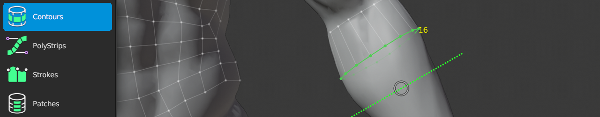

# Contours Help 

The Contours tool gives you a quick and easy way to retopologize cylindrical forms.
For example, it's ideal for organic forms, such as arms, legs, tentacles, tails, horns, etc.

The tool works by drawing strokes perpendicular to the form to define the contour of the shape.
Each additional stroke drawn will either extrude the current selection or cut a new loop into the edges drawn over.

You may draw strokes in any order, from any direction.

## Drawing

|  |  |  |
| --- | --- | --- |
| {{insert}} | : | draw contour stroke perpendicular to form. newly created contour extends selection if applicable. |
| {{action}} | : | slide selected loop |
| {{select smart, select smart add}} | : | select loop |
| {{select, select add}} | : | select edge |
| {{select all}} | : | deselect / select all |
| {{fill}} | : | Bridge selected edge loops |

## Transform

|  |  |  |
| --- | --- | --- |
| {{grab}} | : | slide |
| {{rotate plane}} | : | rotate loop in plane |
| {{rotate screen}} | : | rotate loop in screen |

## Other

|  |  |  |
| --- | --- | --- |
| {{delete}} | : | delete/dissolve selected |
| {{increase count}}   {{decrease count}} | : | increase / decrease segment counts |

## Tips

- Extrude Contours from an existing edge loop by selecting it first.
- Contours works with symmetry, enabling you to contour torsos and other symmetrical objects!
