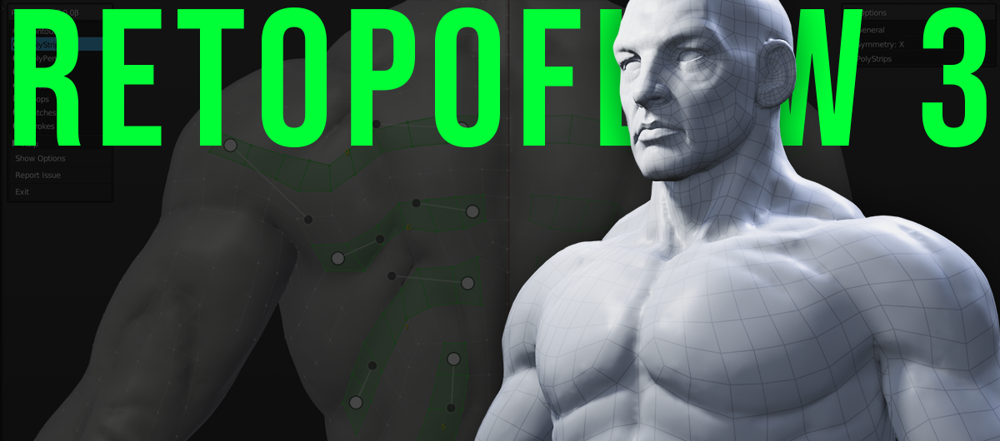
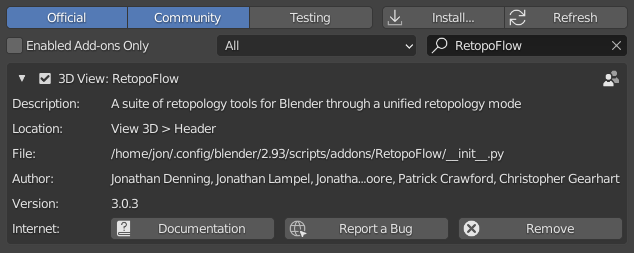

# Introduction

Welcome to the RetopoFlow documentation!

RetopoFlow is a complete set of retopologize tools for Blender designed for artists. This documentation covers the installation and usage of all tools included in the add-on.

If you’re brand new to RetopoFlow, check the Getting Started page, otherwise jump right over to the Tools section.

## Requirements

RetopoFlow v3.x requires Blender 2.83 or newer, and will work on any operating system Blender supports.

## Download and Install

You may download RetopoFlow from your account dashboard on the Blender Market, assuming you’ve already purchased it. If you have not yet purchased a copy, then you may get it here.

The easiest way to install RetopoFlow is to do so directly from Blender. You can do this by going to `File > User Preferences > Add-ons > Install` from File. This will open a File Browser in Blender, allowing to you navigate to and select the .zip file you downloaded. Press Install from file.

_If your browser auto-extracted the downloaded .zip file then you will need to re-compress the **RetopoFlow** folder before installing._

Once installed, Blender should automatically filter the addons list to show only RetopoFlow. You can then enable the add-on by clicking the checkbox on the upper right of the add-on panel.

## Getting Support

Running into a problem or have a question that the documentation isn’t answering? Reach out to us via the retopoflow@cgcookie.com

