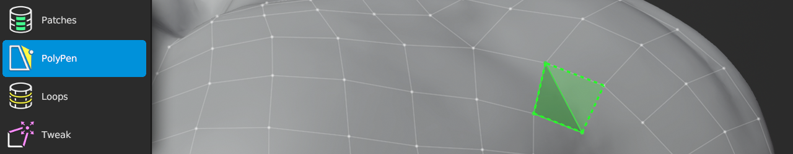

#  Knife Help

Shortcut: {{knife tool}}

The Knife tool allows you to cut up existing geometry.

<!--  -->

## Creating

|  |  |  |
| --- | --- | --- |
| {{insert}} | : | insert geometry connected to selected geometry |

## Selecting

|  |  |  |
| --- | --- | --- |
| {{select single, select single add}} | : | select geometry |
| {{select paint, select paint add}}   | : | paint geometry selection |
| {{select all}}                       | : | select / deselect all |
| {{deselect all}}                     | : | deselect all |

## Transforming

|  |  |  |
| --- | --- | --- |
| {{grab}}             | : | grab and move selected geometry |
| {{action}}           | : | grab and move selected geometry under mouse |
| {{smooth edge flow}} | : | smooths edge flow of selected geometry |

## Other

|  |  |  |
| --- | --- | --- |
| {{delete}} | : | delete/dissolve selected |

