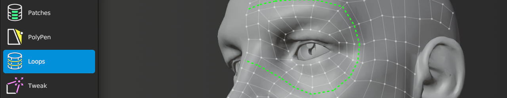

# Loops Help 

Shortcut: {{loops tool}}

The Loops tool allows you to insert new edge loops along a face loop and slide any edge loop along the source mesh.
The Loops tool also works on any strip of edges.

## Creating

|  |  |  |
| --- | --- | --- |
| {{insert}} | : | insert edge loop |

## Selecting

|  |  |  |
| --- | --- | --- |
| {{select single, select single add}} | : | select edges |
| {{select smart, select smart add}}   | : | smart select loop |
| {{select paint, select paint add}}   | : | paint edge selection |
| {{select all}}                       | : | deselect / select all |

## Transforming

|  |  |  |
| --- | --- | --- |
| {{slide}}  | : | slide loop |
| {{action}} | : | if mouse over unselected geometry, smart select loop under mouse.   grab and slide selected geometry under mouse |

