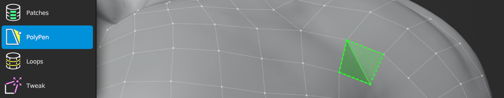

#  PolyPen Help

Shortcut: {{polypen tool}}

The PolyPen tool provides absolute control for creating complex topology on a vertex-by-vertex basis (e.g., low-poly game models).
This tool lets you insert vertices, extrude edges, fill faces, and transform the subsequent geometry all within one tool and in just a few clicks.

## Creating

|  |  |  |
| --- | --- | --- |
| {{insert}} | : | insert geometry connected to selected geometry |

## Selecting

|  |  |  |
| --- | --- | --- |
| {{select single, select single add}} | : | select geometry |
| {{select paint, select paint add}}   | : | paint geometry selection |
| {{select path add}}                  | : | select along shortest path |
| {{select all}}                       | : | select / deselect all |
| {{deselect all}}                     | : | deselect all |

## Transforming

|  |  |  |
| --- | --- | --- |
| {{grab}}             | : | grab and move selected geometry |
| {{action}}           | : | grab and move selected geometry under mouse |
| {{smooth edge flow}} | : | smooths edge flow of selected geometry |
| {{rotate}}           | : | rotate selected geometry |
| {{scale}}            | : | scale selected geometry |

## Other

|  |  |  |
| --- | --- | --- |
| {{delete}}   | : | delete/dissolve/collapse selected |
| {{rip}}      | : | rip selected edge |
| {{rip fill}} | : | rip and fill selected edge |

## Insertion Modes

Creating vertices/edges/faces is dependent on the selected mode and the selected geometry.
Switch between modes using the PolyPen Options, or hold {{pie menu alt0}} to bring up a the PolyPen pie menu.

### Triangle/Quad Insert Mode

The Tri/Quad mode is the normal mode for PolyPen.

- When nothing is selected, a new vertex is added.
- When a single vertex is selected, an edge is added between mouse and selected vertex.
- When an edge is selected, a triangle is added between mouse and selected edge.
- When a triangle is selected, a vertex is added to the triangle, turning the triangle into a quad

Selecting an edge and clicking onto another edge will create a quad in one step.

### Quad-Only Insert Mode

The Quad-Only mode reduces the number of clicks for creating a strip of quads.

- When nothing is selected, a new vertex is added.
- When a single vertex is selected, an edge is added between mouse and selected vertex.
- When an edge is selected, an edge is added centered on the mouse, and a quad is added between the selected and newly added edges.

Selecting an edge and clicking onto another edge will create a quad in one step.

### Triangle-Only Insert Mode

The Tri-Only mode is similar to the Tri/Quad mode, except without the step that turns the selected triangle into a quad.

- When nothing is selected, a new vertex is added.
- When a single vertex is selected, an edge is added between mouse and selected vertex.
- When an edge is selected, a triangle is added between mouse and selected edge.

### Edge-Only Insert Mode

The Edge-Only mode inserts only edges.

- When nothing is selected, a new vertex is added.
- When a single vertex is selected, an edge is added between mouse and selected vertex.

## Additional Tips

The PolyPen tool can be used like a knife, cutting vertices into existing edges for creating new topology routes.
