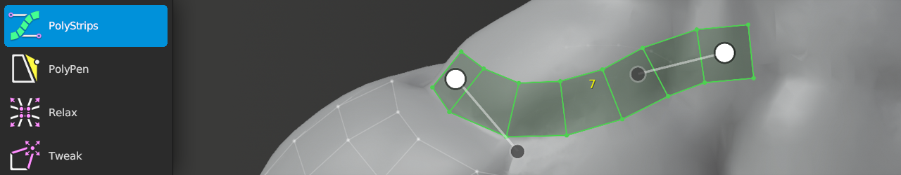

#  PolyStrips Help 

Shortcut: {{polystrips tool}}

The PolyStrips tool provides quick and easy ways to map out key face loops for complex models.
For example, if you need to retopologize a human face, creature, or any other complex organic or hard-surface object.

PolyStrips works by hand drawing strokes on to the high-resolution source object.
The strokes are instantly converted into spline-based strips of polygons.

Any continuous quad strip may be manipulated with PolyStrips via the auto-generated spline handles.

## Creating

|  |  |  |
| --- | --- | --- |
| {{insert}}         | : | draw strip of quads |
| {{brush radius}}   | : | adjust brush size |
| {{action}}         | : | grab and move selected geometry |
| {{increase count}} | : | increase segment counts in selected strip |
| {{decrease count}} | : | decrease segment counts in selected strip |

## Selecting

|  |  |  |
| --- | --- | --- |
| {{select single, select single add}} | : | select face |
| {{select paint, select paint add}}   | : | paint face selection |
| {{select all}}                       | : | select / deselect all |
| {{deselect all}}                     | : | deselect all |

## Control Points

The following actions apply to when the mouse is hovering over control points of selected strip.

|  |  |  |
| --- | --- | --- |
| {{action}}      | : | grab and move control point under mouse |
| {{action alt0}} | : | grab and move all inner control points around neighboring outer control point |
| {{action alt1}} | : | scale strip width by dragging on inner control point |

## Transforming

|  |  |  |
| --- | --- | --- |
| {{action}}  | : | grab and move selected geometry under mouse |
| {{grab}}    | : | grab and move selected geometry |

## Other

|  |  |  |
| --- | --- | --- |
| {{delete}} | : | delete/dissolve selected |
