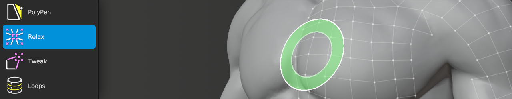

# Relax Help 

Shortcut: {{relax tool}}

The Relax tool allows you to easily relax the vertex positions using a brush.

## Actions

|  |  |  |
| --- | --- | --- |
| `Action` | : | relax all vertices within brush radius |
| `Shift+Action` | : | relax only selected vertices within brush radius |
| `F` | : | adjust brush size |
| `Shift+F` | : | adjust brush strength |
| `Ctrl+F` | : | adjust brush falloff |

## Options

Relax has several options to control which vertices are or are not moved.

- Boundary: check to prevent boundary vertices from moving.
- Hidden: check to prevent vertices hidden by source mesh(es) from moving.
- Selected: check to prevent selected vertices from moving.
