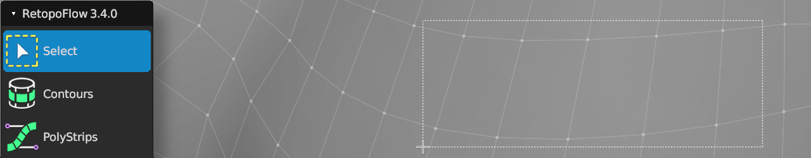

#  Select Help

Shortcut: {{select tool}}

Quick Shortcut: {{select quick}}

The select tool allows you to box select vertices.

Note: This tool is very basic at the moment.

## Selecting

|  |  |  |
| --- | --- | --- |
| {{select box}}     | : | box select vertices |
| {{select box del}} | : | remove vertices from selection |
| {{select box add}} | : | add vertices to selection |

## General

|  |  |  |
| --- | --- | --- |
| {{grab}}     | : | grab and move selected geometry |
| {{rotate}}   | : | rotate selected geometry |
| {{scale}}    | : | scale selected geometry |
| {{delete}}   | : | delete/dissolve/collapse selected |
| {{rip}}      | : | rip selected edge |
| {{rip fill}} | : | rip and fill selected edge |
