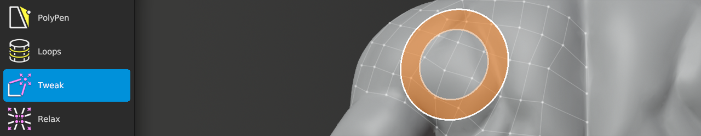

#  Tweak Help

Shortcut: {{tweak tool}}

Quick Shortcut: {{tweak quick}}

The Tweak tool allows you to easily adjust vertex positions with a brush.

## Transforming

|  |  |  |
| --- | --- | --- |
| {{brush}}          | : | tweak all vertices within brush |
| {{brush alt}}      | : | tweak only selected vertices within brush |

## Changing Brush Options

|  |  |  |
| --- | --- | --- |
| {{brush radius}}   | : | adjust brush size |
| {{brush strength}} | : | adjust brush strength |
| {{brush falloff}}  | : | adjust brush falloff |

These options can also be stored as presets in the Brush Options panel. 

To quickly switch between presets, use the {{pie menu alt0}} pie menu. 

## Masking

Tweak has several options to control which vertices are or are not moved.
Each option is below, along with setting and description.

### Boundary

|  |  |  |
| --- | --- | --- |
| Exclude  | : | Tweak vertices not along boundary |
| Include  | : | Tweak all vertices within brush, regardless of being along boundary |

### Symmetry

|  |  |  |
| --- | --- | --- |
| Exclude  | : | Tweak vertices not along symmetry plane |
| Maintain | : | Tweak vertices along symmetry plane, but keep them on symmetry plane |
| Include  | : | Tweak all vertices within brush, regardless of being along symmetry plane |

### Hidden

|  |  |  |
| --- | --- | --- |
| Exclude  | : | Tweak only visible vertices |
| Include  | : | Tweak all vertices within brush, regardless of visibility |

### Selected

|  |  |  |
| --- | --- | --- |
| Exclude  | : | Tweak only unselected vertices |
| Only     | : | Tweak only selected vertices |
| All      | : | Tweak all vertices within brush, regardless of selection |

