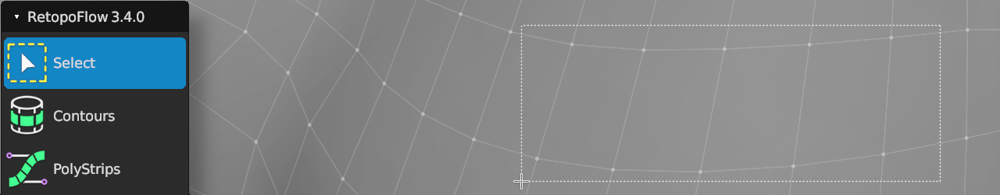

#  Select Help

Shortcut: {{ site.data.keymaps.select_tool }}

Quick Shortcut: {{ site.data.keymaps.select_quick }}

The select tool allows you to box select vertices.

Note: This tool is very basic at the moment.

## Selecting

| :--- | :--- | :--- |
| {{ site.data.keymaps.select_box }}     | : | box select vertices |
| {{ site.data.keymaps.select_box_del }} | : | remove vertices from selection |
| {{ site.data.keymaps.select_box_add }} | : | add vertices to selection |

## General

| :--- | :--- | :--- |
| {{ site.data.keymaps.grab }}     | : | grab and move selected geometry |
| {{ site.data.keymaps.rotate }}   | : | rotate selected geometry |
| {{ site.data.keymaps.scale }}    | : | scale selected geometry |
| {{ site.data.keymaps.delete }}   | : | delete/dissolve/collapse selected |
| {{ site.data.keymaps.rip }}      | : | rip selected edge |
| {{ site.data.keymaps.rip_fill }} | : | rip and fill selected edge |

