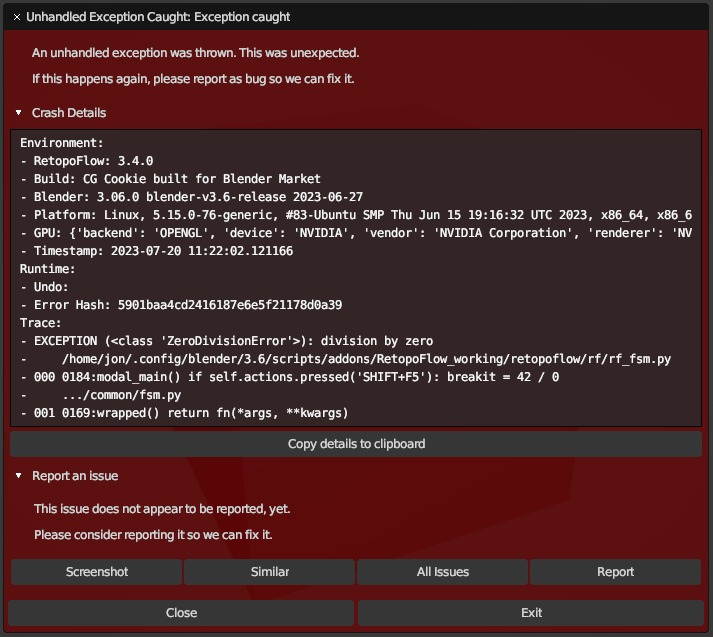

# Welcome to RetopoFlow 3.0.0α!

RetopoFlow is an add-on for Blender that brings together a set of retopology tools within a custom Blender mode to enable you to work more quickly, efficiently, and in a more artist-friendly manner.
The RF tools, which are specifically designed for retopology, create a complete workflow in Blender without the need for additional software.

The RetopoFlow tools automatically generate geometry by drawing on an existing surface, snapping the new mesh to the source surface at all times, meaning you never have to worry about your mesh conforming to the original model---no Shrinkwrap modifier required!
Additionally, all mesh generation is quad-based (except for PolyPen).

## Version 3.0 Notes

Welcome to the newest version of RetopoFlow!
This version of RetopoFlow has been modified to work in Blender 2.8x.
Note: this version will _not_ work in Blender 2.79b or earlier.

Due to some significant changes in the Blender 2.80 Python API, we had to rewrite a few key parts of RetopoFlow, specifically the rendering and UI.
Rather than keeping these updates only for RetopoFlow users, we decided to build the changes into a new framework called [CookieCutter](https://github.com/CGCookie/addon_common).
The CookieCutter framework has several brand new systems to handle states, UI drawing and interaction, debugging and exceptions, rendering, and much more.
CookieCutter was built from the ground up to be a maintainable, extensible, and configurable framework for Blender add-ons.

The new RetopoFlow sits on top of the CookieCutter framework, and we are excited to show off CookieCutter's features through RetopoFlow!

But with any unveiling on new things, there are new bugs and performance issues.
Our hope is that these problems will be much easier to fix in the new CookieCutter framework.
We will need your help, though.

Whenever you see a bug, please let us know so that we can fix them!
Be sure to submit screenshots, .blend files, and/or instructions on reproducing the bug to our bug tracker by clicking the "Report Issue" button or visiting [GitHub Issues](https://github.com/CGCookie/retopoflow/issues).
We have added buttons to open the issue tracker in your default browser and to save screenshots of Blender.

## Feedback

We want to know how RetopoFlow has benefited you in your work.
Please consider doing the following:

- Give us a rating with comments on the Blender Market.  (requires purchasing a copy through Blender Market)
- Purchase a copy of RetopoFlow on the Blender Market to help fund future developments.
- Consider donating to our drink funds :)

We have worked hard to make this as production-ready as possible.
We focused on stability and bug handling in addition to new features, improving overall speed, and making RetopoFlow easier to use.

## Known Issues / Future Work

Below is a list of known issues that we are currently working on.

- UI starts to become sluggish when there is lots of text (ex: Welcome help).
- Patches supports only rudimentary fills.
- The 3D view panel tabs (left, top, right) flicker slightly when RetopoFlow redraws.

## Final Words

We thank you for using RetopoFlow, and we look forward to hearing back from you!

Cheers!

 
---The CG Cookie Tool Development Team
